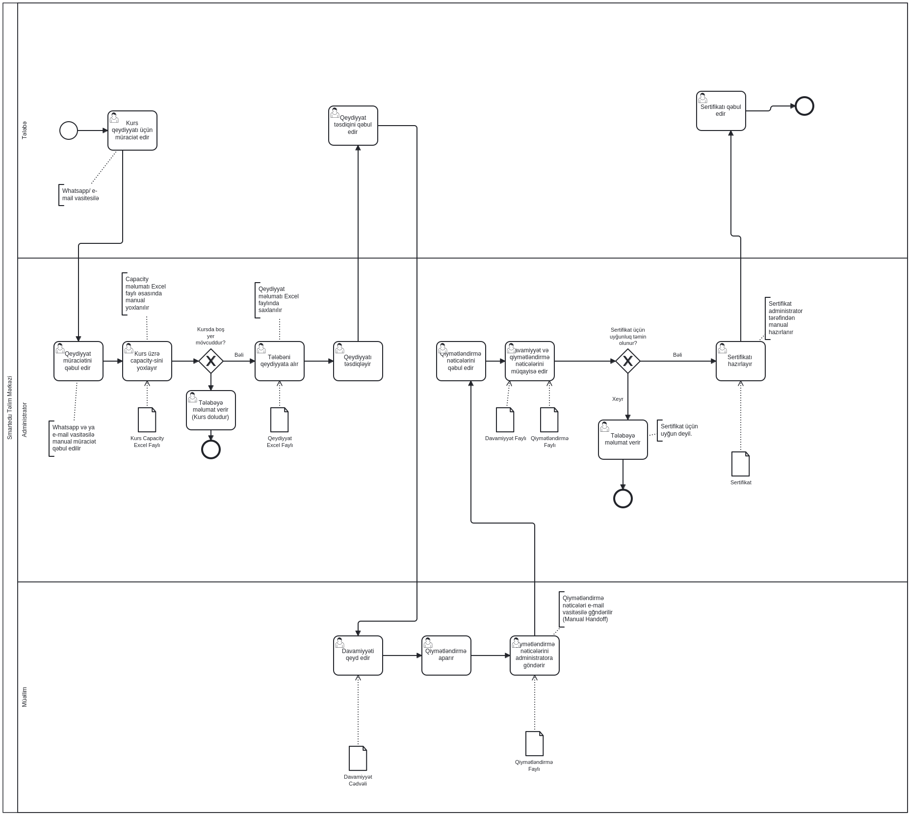
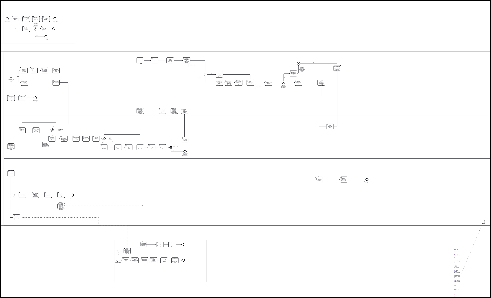

SmartEdu

Digital Course & Certification Management Platform

BUSINESS REQUIREMENTS DOCUMENT

BRD • Version 1.1 • Draft for Business / Technical Review

| Project | SmartEdu — Digital Course & Certification Management Platform |
| --- | --- |
| Document type | Business Requirements Document (BRD) |
| Version | 1.1 — Reviewed |
| Status | Draft for Business / Technical Review |
| Prepared by | Elmira Məmmədzadə Aysel Abbasəliyeva Vüsalə Həsənzadə Alimə Kərimova |
| Date | August 2026 |
| Confidentiality | Internal use only |

| About this document: This Business Requirements Document covers SmartEdu's business needs, scope, AS-IS and TO-BE processes, functional and non-functional requirements, business rules, traceability matrix, and acceptance criteria. Technical solutions are provided in the related “SmartEdu — Technical Document Package”. |
| --- |

TABLE OF CONTENTS

Document information4

Project team4

RACI Matrisi — Team Roles & Responsibilities4

Document Control4

Revision History5

1. Problem Statement and Business Need6

1.1 Project Overview6

1.2 Problem Statement6

1.3 Business Need6

1.4 Project objectives6

1.5 Relationship between Business Need and Objectives7

1.6 Success Criteria7

1.7 Business Needs Catalog7

2. Scope / Out of Scope8

2.1 In Scope8

2.2 Out of Scope8

2.3 Assumptions9

2.4 Dependencies9

2.5 Constraints10

2.6 Open Questions / Business Decisions10

3. Stakeholder Register11

3.1 Stakeholder register12

3.2 Areas of responsibility13

4. Elicitation Plan14

4.1 Overview14

4.2 Document purpose14

4.3 Requirements elicitation techniques14

4.4 Participating stakeholders14

4.5 Meetings and sources15

4.6 Open questions and answers15

5. AS-IS Process Analysis16

5.1 AS-IS process description16

5.2 AS-IS BPMN 2.0 Diagram16

5.3 Key AS-IS observations18

6. Pain Points and Root Cause Analysis19

6.1 Pain Points Analysis19

6.2 Fishbone Analysis Summary19

7. TO-BE Process Analysis21

7.1 TO-BE process description21

7.2 TO-BE BPMN 2.0 Diagram21

7.3 Key AS-IS → TO-BE changes23

7.4 TO-BE outcome23

8. Glossary and Status Lifecycles24

8.1 Key Terms24

8.2 Status Lifecycle24

9. TO-BE Analysis Document25

9.1 Solution Overview25

9.2 Functional Areas25

9.3 Functional Requirements25

9.4 Automated Business Controls29

9.5 Expected Business Value29

10. Non-Functional Requirements30

10.1 Security & Access Control30

10.2 Audit & Traceability30

10.3 Data Integrity & Availability30

10.4 Usability & Localization30

10.5 Performance30

11. User Stories and Acceptance Criteria31

11.1 Epic Structure31

11.2 User Stories31

11.3 Acceptance Criteria33

12. Business Rules / Validations / Edge Cases37

12.1 Business Rules Catalog37

12.2 Validation Catalog39

12.3 Edge Case Catalog42

13. API Specification44

14. Risk Register45

15. Requirements Traceability Matrix46

15.1 Coverage Check47

15.2 Traceability Matrix47

16. Test Cases and UAT54

16.1 Test Case Kataloqu54

16.2 User Acceptance Testing (UAT)59

17. Sign-off62

## Document information

### Project team

| Team Member | Role |
| --- | --- |
| Elmira Məmmədzadə | ITBA Lead / Coordinator |
| Aysel Abbasəliyeva | Technical Analyst |
| Vüsalə Həsənzadə | Process  Analyst |
| Alimə Kərimova | Requirements / QA Analyst |

Table 1. Project team and roles

### RACI Matrisi — Team Roles & Responsibilities

| Process stages and tasks | Elmira | Vüsalə | Alimə | Aysel |
| --- | --- | --- | --- | --- |
| Project coordination and task allocation | A/R | I | I | I |
| Current process analysis and AS-IS preparation | C | C | I | A/R |
| Improved process and TO-BE preparation | C | A/R | C | C |
| Requirements elicitation and analysis | A | C | R | C |
| Preparation of Functional / Non-Functional Requirements | A | C | R | C |
| Preparation of User Stories and Acceptance Criteria | A | C | R | C |
| Business Rules / Validations / Edge Cases | A | C | R | C |
| Preparation of API requirements and endpoints | A/R | I | C | I |
| API Documentation / OpenAPI section | A/R | I | C | I |
| Test Scenarios / Test Cases and QA checks | A | I | R | I |
| Final document review and consolidation | A/R | C | C | C |

Table 2. RACI matrix (R — Responsible, A — Accountable, C — Consulted, I — Informed)

### Document Control

| Field | Information |
| --- | --- |
| Document Title | SmartEdu — Business Requirements Document (BRD) |
| Solution | Digital Course & Certification Management Platform |
| Version | 1.1 — Reviewed |
| Status | Draft for Business / Technical Review |
| Prepared By | Elmira Məmmədzadə; Aysel Abbasəliyeva; Vüsalə Həsənzadə; Alimə Kərimova |
| Review Date | August 2026 |
| Confidentiality | Internal use only |

Table 3. Document control

### Revision History

| Version | Date | Change Summary | Owner |
| --- | --- | --- | --- |
| 1.0 | August 2026 | Initial BRD baseline. | Project Team |
| 1.1 | August 2026 | Senior BA review: structure normalization, consistency/data model/API, risk, traceability and UAT/sign-off alignment. | ITBA Lead |

Table 4. Version history

## 1. Problem Statement and Business Need

### 1.1 Project Overview

SmartEdu is a digital course and certificate management platform developed for training centers.

The platform centralizes course creation, enrollment management, attendance tracking, assessment result management, and certification in one digital platform.

SmartEdu enables students to enroll through a self-service portal, track enrollment status, view attendance and assessment results, and obtain electronic certificates. Teachers enter attendance and assessment data; administrators centrally manage courses, users, and certification.

The platform stores all information in one database, automatically applies business rules, and simplifies reporting to improve the training center's operational efficiency.

### 1.2 Problem Statement

The training center currently manages course enrollment, attendance, assessment, and certification through different Excel files, WhatsApp, and email. Information is fragmented, with no single database. This makes the full course lifecycle difficult to track, increases manual operations and human error, and prevents students from tracking enrollment, attendance, assessment, and certificate status in real time.

Manual handoffs between processes cause operational delays, inconsistent data, and reduced efficiency, mainly affecting students, teachers, and administrators. The current Excel/email approach cannot effectively manage growing user numbers.

The absence of audit logs and traceable process mechanisms also makes subsequent analysis and checks difficult.

### 1.3 Business Need

The training center needs to combine enrollment, attendance, assessment, and certification in one traceable, automated digital platform. The new system must reduce manual operations, perform automatic validations, offer a student self-service portal, calculate certificate eligibility automatically, and enable real-time administrator reporting.

The project aims to improve operational efficiency, minimize human error, increase data quality, and improve user satisfaction.

### 1.4 Project objectives

The project's main objectives are:

Automate course enrollment.

Create a student self-service portal.

Automatically check capacity and prerequisites.

Digitize attendance and assessment.

Automatically calculate certificate eligibility.

Generate electronic certificates.

Provide timely administrator reports.

Establish a single, reliable database at the training center.

### 1.5 Relationship between Business Need and Objectives

Business Need defines the project's main business objectives. These become functional and non-functional requirements, linked to user stories, BPMN processes, API design, the database model, and test scenarios to ensure full project traceability.

### 1.6 Success Criteria

The following outcomes are targeted for project success:

Significantly reduce manual enrollment operations.

Automatically check capacity and prerequisites.

Automatically calculate certificate eligibility in the system.

Significantly reduce report preparation time.

Minimize duplicate data and establish a single database.

Enable students to track enrollment and result status in real time through a self-service portal.

### 1.7 Business Needs Catalog

| BN ID | Business need |
| --- | --- |
| BN-01 | Automate course enrollment and create a student self-service portal |
| BN-02 | Automatically enforce capacity, prerequisite, and duplicate enrollment rules at system level |
| BN-03 | Digitize attendance and assessment and store them in a single information source |
| BN-04 | Automatically calculate certificate eligibility and generate/verify electronic certificates |
| BN-05 | Student self-service tracking of enrollment, attendance, result, and certificate status |
| BN-06 | Provide JWT/RLS-based role and ownership controls, audit trails, and data boundaries |
| BN-07 | Provide administrator course/result/certificate reports |

Table 5. Business Needs Catalog

## 2. Scope / Out of Scope

### 2.1 In Scope

SmartEdu covers end-to-end digitization and unified management of course enrollment, attendance, assessment, and certification at a training center.

The following capabilities are In Scope for the current phase:

Course and teaching data management: Centrally manage courses, course sessions, teachers, and students.

Course search and viewing: Students can view OPEN courses with vacant seats.

Online course enrollment: Students enroll themselves in eligible courses through the system.

Capacity check: Automatically check course instance capacity during enrollment.

Prerequisite check: Automatically determine whether the student meets a required course prerequisite.

Duplicate enrollment control: Prevent multiple active enrollments by the same student in the same course instance.

Attendance management: Teachers enter attendance only for assigned courses and sessions.

Assessment management: Teachers enter assessment results, evaluated against the defined passing score.

Certificate eligibility calculation: Automatically determine eligibility from attendance percentage and assessment result.

Electronic certificate generation and verification: Generate a certificate with a unique verification code for eligible students and verify it using that code.

Self-service tracking: Students track enrollment, attendance, assessment result, and certificate status in one profile.

Reporting: Administrators obtain key reports on courses, students, results, and certificates.

Business Rules and validations: Enforce the project's main business rules through system-level validation and business logic.

### 2.2 Out of Scope

The following functionality and integrations are excluded from the current phase. They may be considered in future phases through separate business decisions, technical assessment, and resource planning:

Payments and financial operations — billing, invoicing, and payment gateway integrations.

Native mobile application — separate native iOS/Android applications; the current scope covers a web-based platform only.

Third-party LMS and video-conferencing integration — actual integration with external platforms.

HR and payroll — teacher recruitment, payroll, and other HR processes.

Physical infrastructure management — classroom reservations and equipment management.

AI functionality — course recommendation engines and adaptive learning.

Physical certificate management — printing and physical delivery of certificates.

Legacy data migration — full migration of historical Excel data to production; only a conceptual approach is included.

Performance and production deployment — load/performance testing and deployment to a real production environment.

### 2.3 Assumptions

The scope and TO-BE solution are based on these assumptions:

Existing course, student, and teacher information can be obtained from Excel and other current sources. Full historical data migration is outside the execution scope.

A student may enroll in several different courses simultaneously. Multiple active enrollments in the same course instance are prohibited.

The system automatically checks capacity, prerequisites, and duplicate enrollment during enrollment.

Teachers enter attendance only for their assigned courses and sessions.

Assessment results are evaluated against the defined pass score.

Certificate eligibility is automatically determined from attendance and assessment results.

Eligible students receive an electronic certificate verifiable through a unique verification code.

The initial system supports one training center; multi-tenant architecture is outside the current scope.

The system is web-based; a separate native mobile application is not required.

The last assumption also matches the web-based approach in the existing Scope document.

### 2.4 Dependencies

Successful development and implementation depend on:

The business providing accurate, current course, student, and teacher data.

The Business Owner defining and approving capacity, prerequisites, pass score, and minimum attendance.

Correct assignment of courses and sessions to teachers.

The relevant stakeholder providing and approving the e-certificate template.

Correct storage of verification codes and certificate statuses for public verification.

Selection of an email service and technical configuration if email notifications are implemented.

A separate migration plan and data mapping rules if legacy migration is implemented.

### 2.5 Constraints

The current phase is limited to a web-based platform; native mobile applications are excluded.

Payment, third-party LMS/video-conferencing, HR/payroll, physical infrastructure, and AI functionality are outside the current release scope.

Full legacy Excel migration is excluded; initial master data loading requires a separate decision.

Production deployment and load/performance testing are Out of Scope; numeric NFRs must be approved during Technical Design.

Public certificate verification must return only authorized, minimal information.

### 2.6 Open Questions / Business Decisions

The following open questions require final business or technical decisions:

| № | Open question | Responding party |
| --- | --- | --- |
| Q1 | How should the student enrollment cancellation deadline be defined? | Business Owner |
| Q2 | Should e-certificate PDFs be stored within the system or in separate storage? | Technical Team / Admin |
| Q3 | May students retake a course after a FAILED result, and which rules will apply? | Business Owner |
| Q4 | Which information may be shown to public users during certificate verification? | Business Owner / Admin |
| Q5 | Which processes require email notifications (enrollment, cancellation, result, certificate, etc.)? | Business Owner |

Table 6. Open Questions / Business Decisions

## 3. Stakeholder Register

This section identifies stakeholders who influence project development, implementation, use, and acceptance. The Stakeholder Register defines their roles, interest and influence levels, responsibilities, and interaction with the project.

### 3.1 Stakeholder register

Document No.: 3 | Prepared on: 01.08.2026 | Revision date: 10.08.2026

| Stakeholder | Position | Category | Influence | Interest | Expectation | Communication type | Tezlik | Kanal | Risks | Level |
| --- | --- | --- | --- | --- | --- | --- | --- | --- | --- | --- |
| Samir Hüseynov | Student | External | Medium | High | Convenient course enrollment and secure, timely tracking of attendance, results, and certificate status in one platform. | Formal business meetings | Weekly | Microsoft Teams, Email | Delayed notifications or lack of awareness of system changes. | High |
| Gülnar Hacıyeva | Administrator | Internal | High | High | Efficient management of courses, enrollments, and certificates in one system, with timely report preparation. | Formal business meetings | Weekly | Microsoft Teams, Email | Late or incomplete information. | High |
| Məleykə Məmmədova | Teacher | Internal | Medium | High | Easy entry of attendance and assessment data and accurate management of results. | Formal business meetings | Weekly | Microsoft Teams, Email | Late entry of attendance and assessment data. | High |
| Alim Hacıyev | Course Manager | Internal | High | High | Effective management of course planning, participant limits, and course information. | Formal business meetings | Weekly | Microsoft Teams, Email | Late notification of subsequent changes to requirements and course plans. | High |
| Səlim Qasımlı | Backend developer | Internal | High | Medium | Clearly presented functional requirements and continuous support during technical development. | Formal business meetings | Daily | Microsoft Teams, Email | Unclear functional requirements or subsequent changes. | High |
| Firuzə Nağıyeva | Frontend developer | Internal | High | Medium | A stable, easy-to-use interface that meets approved UI requirements. | Formal business meetings | Daily | Microsoft Teams, Email | Frequent changes to or delayed approval of UI/UX requirements. | High |
| Aysel Əhmədova | QA Engineer | Internal | Medium | High | Testable requirements and timely resolution of identified issues. | Formal business meetings | Weekly | Microsoft Teams, Email | Delayed delivery of a stable test version or incomplete requirements. | High |
| Sevil Hüseynova | Project Manager | Internal | High | High | On-time project delivery within the defined scope and objectives. | Formal business meetings | Weekly | Microsoft Teams, Email | Late status updates and insufficient stakeholder coordination. | High |
| Cəlal Əliyev | IT Business Analyst | Internal | High | High | Accurate analysis and documentation of business requirements and clear communication to the technical team. | Formal business meetings | Weekly | Microsoft Teams, Email | Different stakeholder expectations and insufficiently clarified requirements. | High |
| Kamil Əliyev | Product Owner | Internal | High | High | Product development aligned with business goals and user needs. | Formal business meetings | Weekly | Microsoft Teams, Email | Frequent priority changes and delayed decisions. | High |
| Şirin Həsənli | UX/UI Designer | Internal | High | Medium | Product design development aligned with business goals and needs. | Formal business meetings | Weekly | Microsoft Teams, Email | Late communication of tasks to be resolved. | Medium |

Table 7. Stakeholder Register — stakeholders, influence/interest, and communication plan

### 3.2 Areas of responsibility

| Stakeholder | Position | Area of responsibility in the project |
| --- | --- | --- |
| Samir Hüseynov | Student | The system's main end user. Enrolls in courses and tracks attendance, assessment results, and certificate status through the platform. |
| Gülnar Hacıyeva | Administrator | The main user responsible for managing courses, students, enrollments, and certificates. |
| Məleykə Məmmədova | Teacher | Enters and manages attendance and assessment data for the courses they teach. |
| Alim Hacıyev | Course Manager | Responsible for course creation and planning, participant limits, and course parameters. |
| Səlim Qasımlı | Backend developer | Develops the server side, APIs, and system integrations in accordance with business requirements. |
| Firuzə Nağıyeva | Frontend developer | Develops the user interface and ensures ease of use. |
| Aysel Əhmədova | QA Engineer | Tests compliance with functional requirements and records identified discrepancies. |
| Sevil Hüseynova | Project Manager | Plans the project, manages resources, and oversees implementation. |
| Cəlal Əliyev | IT Business Analyst | Collects, analyzes, and documents business requirements and connects the business with the technical team. |
| Kamil Əliyev | Product Owner | Sets product development priorities, approves functionality, and ensures alignment with business goals. |
| Şirin Həsənli | UX/UI Designer | Sets product design development priorities, approves functionality, and ensures alignment with business goals. |

Table 8. Stakeholder responsibilities in the project

## 4. Elicitation Plan

The Elicitation Plan defines activities for identifying, clarifying, and approving business and functional requirements. It covers stakeholder participation, methods, key topics, expected outputs, and responsible people.

### 4.1 Overview

| Field | Information |
| --- | --- |
| Parent request / Epic / Task | SmartEdu — Training Center |
| Initiator | Training Center (Business) |
| IT Business Analyst | Aysel Abbasəliyeva |

Table 9. Elicitation Plan — overview

### 4.2 Document purpose

This document defines elicitation methods and techniques for collecting business and user requirements for SmartEdu enrollment, attendance, assessment, and certification. It supports effective information collection from Administrator, Teacher, and Student stakeholders and complete, accurate, traceable requirements.

### 4.3 Requirements elicitation techniques

| Texnika | Applied |
| --- | --- |
| Business Interviews | ✔ Yes |
| Questionnaires and surveys | —  Xeyr |
| Workshops and working groups | —  Xeyr |
| Observation | ✔ Yes |
| Scenarios and prototypes | —  Xeyr |
| Document Analysis | ✔ Yes |
| Focus groups | —  Xeyr |
| Process description, Modeling | ✔ Yes |

Table 10. Elicitation techniques applied in the project

### 4.4 Participating stakeholders

| Stakeholder | Category | Influence | Interest | Expectation | Communication method |
| --- | --- | --- | --- | --- | --- |
| Administrator | Internal | High | High | Access to enrollment, attendance, assessment, and certificate information from a single source, with course reports. | Face-to-face interview |
| Teacher | Internal | Orta (Medium) | High | Record and manage attendance and assessment data in one system. | Face-to-face interview |
| Student | Internal | Orta (Medium) | High | Track course enrollment status, attendance, assessment results, and certificate status in one platform. | Online Survey + Follow-up Online Interview |

Table 11. Stakeholders participating in requirements elicitation

### 4.5 Meetings and sources

| Stakeholder | Texnika | Date | Type | Sources | Fokus |
| --- | --- | --- | --- | --- | --- |
| Administrator | Business Interview | 05.08.2026 10:00 | Offline | AS-IS Scenario Registration Excel file Course Capacity file | Course enrollment, capacity management, certificate eligibility, reporting, and identification of current pain points. |
| Teacher | Business Interview | 05.08.2026 11:00 | Offline | AS-IS Scenario Attendance Sheet Assessment Records | Attendance recording, assessment result management, and analysis of information exchange with the administrator. |
| Student | Business Interview | 05.08.2026 12:00 | Online | AS-IS Scenario Registration Communication (WhatsApp / Email) | Understanding the user experience of course enrollment, status tracking, and access to assessment results and certificate status. |

Table 12. Meeting plan and sources

### 4.6 Open questions and answers

| Role | Sual | Cavab |
| --- | --- | --- |
| User name | Question | Answer |
| Administrator | How is student course enrollment currently handled, and who participates? | The student applies through WhatsApp or email. The administrator checks vacant seats in a separate Excel file and enters the enrollment manually. |
| Administrator | How are course capacity and prerequisite eligibility currently checked? | Course capacity is checked manually using a separate Excel file. There is no automatic prerequisite check. |
| Administrator | What information determines certificate eligibility? | The administrator manually checks certificate eligibility by comparing attendance and assessment results in different files. |
| Administrator | In which systems or files are course enrollment, attendance, assessment, and certificate information currently stored? | Course enrollment, attendance, assessment results, and certificate information are stored in different Excel files. |
| Administrator | What difficulty arises when preparing current reports? | Preparing course and student reports takes additional time because information is stored in different Excel files. |
| Teacher | How is attendance currently recorded? | The teacher records attendance in a separate spreadsheet. |
| Teacher | How are assessment results submitted to the administrator? | Assessment results are emailed to the administrator. |
| Teacher | How are attendance and assessment data stored and transferred? | Attendance is stored in a separate spreadsheet; assessment results are sent by email. |
| Teacher | Which communication channel is used to send assessment results to the administrator? | Assessment results are emailed to the administrator. |
| Student | Which communication channels do you use to enroll in a course? | Applications are submitted through WhatsApp or email. |
| Student | How do you currently track your course enrollment status? | Enrollment status cannot be tracked in a single platform. |
| Student | How do you currently access your attendance and assessment results? | Attendance and assessment results cannot be tracked in a single platform. |
| Student | How do you currently find out the status of certificate preparation? | Certificate preparation status cannot be tracked in a single platform. |

Table 13. Elicitation questions and answers

## 5. AS-IS Process Analysis

### 5.1 AS-IS process description

The current SmartEdu process covers enrollment, attendance, assessment, and certification.

Courses are planned in different Excel files. Students apply to the Administrator through WhatsApp or email. The Administrator checks vacant seats in a separate file and enters enrollments manually.

Teachers record attendance in a separate spreadsheet and email assessment results to the administrator. The administrator manually checks certificate eligibility by comparing attendance and results.

Students cannot track enrollment, attendance, results, and certificate status in one platform. Separate files create duplication, inconsistencies, and additional reporting time.

### 5.2 AS-IS BPMN 2.0 Diagram

SmartEdu — Current course enrollment, attendance, assessment, and certification process

Figure 1. AS-IS BPMN 2.0 — current course enrollment, attendance, assessment, and certification process

This diagram shows the current AS-IS execution sequence for SmartEdu enrollment, attendance, assessment, and certification, including participants, activities, decisions, and transitions. It provides a basis for identifying manual operations, control points, and areas for TO-BE improvement.

### 5.3 Key AS-IS observations

Information is stored in different files with no single source.

Manual handoffs occur between enrollment, attendance, results, and certification.

Capacity and prerequisite checks are not automated.

Students have no self-service status tracking.

Manual certificate eligibility checks create human error risk.

## 6. Pain Points and Root Cause Analysis

### 6.1 Pain Points Analysis

| ID | Pain point | Business impact | Root cause (Fishbone analysis) | Proposed Solution |
| --- | --- | --- | --- | --- |
| PP-01 | No single source of information | Duplicate and inconsistent data and inaccurate decisions | Process: Information is stored in different Excel files. Technology: No centralized system. | Create a single relational database and centralized platform |
| PP-02 | Course capacity is not checked in real time | Business rule violations and reduced course quality | Process: Capacity is checked manually. Technology: Avtomatik validasiya mexanizmi yoxdur. | Implement real-time automatic capacity validation |
| PP-03 | Prerequisites are checked manually | Enrollment of ineligible students | People: The Administrator checks manually. Technology: Student history is not checked automatically. | Implement automatic prerequisite checks based on student history |
| PP-04 | Manual handoffs | Process delays and delayed user visibility of status | Process: Information is transferred through email and WhatsApp. Technology: Real-time inteqrasiya yoxdur. | Implement a Self-Service portal and real-time notifications |
| PP-05 | Certificate eligibility is calculated manually | Incorrect certificates and additional operational workload | Process: Separate files are compared manually. Technology: No automatic calculation mechanism. | Implement automatic certificate eligibility calculation |
| PP-06 | No Self-Service portal | Higher administrator workload and lower user satisfaction | Technology: Student Portal yoxdur.  People: Users must contact the administrator. | Develop a Student Self-Service Portal |

Table 14. Pain Points Analysis

### 6.2 Fishbone Analysis Summary

Fishbone (Ishikawa) analysis identifies processes, people, technology, and data management as root causes. Most activities are manual, information is fragmented, and no unified system automatically enforces rules. This reduces efficiency, creates inconsistent data, and lowers satisfaction.

#### Process (Proses)

Current processes are mainly manual, without standardized automation.

Main causes:

Manual course enrollment

Manual prerequisite checks

Manual capacity checks

Manual certificate eligibility calculation

Manual handoffs

#### People

Most operations depend on administrator manual work, increasing errors and delays.

Main causes:

High dependence on manual administrator operations

High likelihood of human errors

Users must contact administrators for information

#### Technology (Texnologiya)

Current technology does not support automated rules, integration, or self-service.

Main causes:

No centralized platform

No automatic Business Rule mechanisms

No Self-Service Portal

No real-time integration

No Audit Log mechanism

#### Data

Without a unified system, ensuring data integrity and accuracy is difficult.

Main causes:

Data stored in separate Excel files

Duplicate and inconsistent data

No single centralized database

## 7. TO-BE Process Analysis

### 7.1 TO-BE process description

TO-BE digitizes and automates enrollment, attendance, assessment, and certification end to end in one centralized platform.

The Administrator creates a Course, defines parameters, and publishes it. Students review OPEN Courses and submit online enrollment requests.

The system checks registration window, capacity, duplicates, and prerequisites. Compliant requests are confirmed; others are restricted under relevant rules.

Authorized Teachers enter attendance/results only for assigned instances/sessions. The system calculates eligibility from attendance/results and generates uniquely coded certificates when minimum attendance and pass score are met.

Students track enrollment, attendance, assessment, and certificate status in one platform. Administrators oversee processes and access reports/audits.

### 7.2 TO-BE BPMN 2.0 Diagram

SmartEdu — TO-BE Course Registration, Attendance, Assessment & Certification Process

Figure 2. TO-BE BPMN 2.0 — SmartEdu Course Registration, Attendance, Assessment & Certification Process

| Note: Zoom in to inspect this detailed diagram electronically. |
| --- |

The BPMN model shows target execution, responsibilities among Student/Administrator/Teacher/System, automated validations, decisions, and flows. It automates identified manual operations and enforces rules at system level.

### 7.3 Key AS-IS → TO-BE changes

| AS-IS | TO-BE |
| --- | --- |
| WhatsApp/email enrollment | Online self-service enrollment |
| Manual capacity checks | Automatic capacity checks |
| Manual/unstandardized prerequisite checks | Prerequisite avtomatik validasiya edilir |
| Attendance in separate spreadsheets | Attendance entered in one system |
| Assessment emailed | Assessment entered directly in the system |
| Manual Certificate eligibility checks | Automatic eligibility calculation |
| No unified status tracking | Student self-service tracking |
| Data in separate files | Centralized information management |

Table 15. Key AS-IS → TO-BE changes

### 7.4 TO-BE outcome

TO-BE aims to reduce handoffs and fragmented-source dependence, enforce rules, improve traceability, and create one digital work environment for Students, Teachers, and Administrators.

## 8. Glossary and Status Lifecycles

### 8.1 Key Terms

| Termin | Definition |
| --- | --- |
| Course | General Course definition (name, description, pass_score, min_attendance_percent, prerequisite). Status: DRAFT / OPEN / CLOSED / COMPLETED / CANCELLED / ARCHIVED. |
| Course Instance | Specific Course delivery with start/end dates, capacity, and Teacher assignment. Available seats/enrollment are managed at this level. |
| Session | Specific lesson/meeting within an instance; dates, times, and attendance managed here. |
| Enrollment | Student registration in an instance. Status: ACTIVE / CANCELLED / COMPLETED. |
| Attendance | Session attendance for an Enrollment. Status: PRESENT / ABSENT / LATE / EXCUSED. |
| Assessment Result | Enrollment assessment. result_status: PASSED / FAILED; workflow: DRAFT / SUBMITTED. |
| Certificate | Enrollment certificate. Status: ELIGIBLE / ISSUED / REVOKED. |

Table 16. Key Terms

### 8.2 Status Lifecycle

Course: DRAFT → OPEN → CLOSED → COMPLETED. CANCELLED/ARCHIVED possible at any stage (BR-004, BR-005).

Course Instance: SCHEDULED → ONGOING → COMPLETED. CANCELLED possible at any stage.

Enrollment: ACTIVE → COMPLETED or CANCELLED. Completion makes COMPLETED; self-service/administrative cancellation makes CANCELLED (BR-010, BR-011). No direct return to ACTIVE; re-enrollment creates a new record.

Certificate: ELIGIBLE → ISSUED → REVOKED. Eligibility is determined under BR-018–BR-022; Administrators issue under BR-024; revocation is possible under BR-025.

## 9. TO-BE Analysis Document

### 9.1 Solution Overview

SmartEdu unifies manual, fragmented processes and supports role-based course management, enrollment, attendance, assessment, certification, and reporting.

### 9.2 Functional Areas

| Functional area | TO-BE solution |
| --- | --- |
| Course Management | Manage Courses, Instances, capacity, and statuses |
| Course Catalog | Show Students available OPEN Courses |
| Enrollment | Online self-service enrollment and cancellation |
| Automated Validation | Check registration window, capacity, duplicates, and prerequisites |
| Attendance | Assigned Teacher session attendance entry |
| Assessment | Teacher result entry |
| Certification | Automatic eligibility/e-certificates from attendance and pass score |
| Student Self-Service | Track enrollment, attendance, result, and certificate statuses |
| Reporting | Main administrator reports |
| Access Control | Role/ownership access restrictions for Student, Teacher, Administrator |

Table 17. Functional Areas

### 9.3 Functional Requirements

#### Administrator

| ID | Requirement name | Functional description | Priority |
| --- | --- | --- | --- |
| FR-ADM-01 | Autentifikasiya | The system must authenticate administrators with the ADMIN role. | High |
| FR-ADM-02 | User management | The system must allow administrators to create, edit, and deactivate STUDENT, TEACHER, and ADMIN accounts. | High |
| FR-ADM-03 | Role assignment | Administrators must be able to assign and change user roles. | High |
| FR-ADM-04 | Teacher assignment | Administrators must be able to create and revoke teacher assignments to specific course instances/sessions. | High |
| FR-ADM-05 | Course management | Administrators must be able to create, edit, delete, or CANCEL courses. | High |
| FR-ADM-06 | Course status | Administrators must be able to manage course instance status. | High |
| FR-ADM-07 | Capacity control | Administrators must not reduce course instance capacity below the current active enrollment count. | Medium |
| FR-ADM-08 | Session management | Administrators must be able to create/edit course instance sessions (date, time, teacher). | High |
| FR-ADM-09 | Prerequisite configuration | Administrators must be able to define course prerequisites. | Medium |
| FR-ADM-10 | Cancellation impact | When a course instance/session is cancelled, the system must identify affected active enrollments and show the administrator an impact list. | Medium |
| FR-ADM-11 | Enrollment search | Administrators must be able to search/filter all enrollments by course, student, and status. | High |
| FR-ADM-12 | Manual enrollment | Administrators must be able to create manual enrollments on students' behalf. | Medium |
| FR-ADM-13 | Administrative cancellation | Administrators must be able to cancel enrollments after the deadline. | Medium |
| FR-ADM-14 | Operation audit | Manual enrollment/cancellation must store the operation date and reason in audit fields. | High |
| FR-ADM-15 | Result correction approval | Administrators must be able to approve corrections to teacher-confirmed assessment results. | Medium |
| FR-ADM-16 | Eligibility list | The system must list certificate eligibility for all students to administrators. | High |
| FR-ADM-17 | Avtomatik eligibility | Eligibility must be calculated automatically from attendance percentage and pass score. | High |
| FR-ADM-18 | Bulk certification | Administrators must be able to bulk-generate e-certificates for ELIGIBLE students. | Medium |
| FR-ADM-19 | Verification code | A unique verification code must be generated for each certificate. | High |
| FR-ADM-20 | Certificate revocation | Administrators must be able to REVOKE ISSUED certificates with a reason. | Medium |
| FR-ADM-21 | Course report | Course instance reports must show enrollment count, occupancy percentage, average attendance, and pass rate. | Medium |
| FR-ADM-22 | Student report | Student reports must show active enrollments, completed courses, and received certificates. | Medium |
| FR-ADM-23 | Pending records | Missing teacher attendance/results (PENDING) must appear on the administrator dashboard. | Medium |
| FR-ADM-24 | Report export | Reports must support date range, course, and status filters and CSV/Excel export. | Low |
| FR-ADM-25 | Audit log search | The system must log all critical operations and allow administrator searches by user, object, and date. | High |
| FR-ADM-26 | Eligibility restriction | Administrators must not manually bypass eligibility rules for individual students. | High |
| FR-ADM-27 | Result restriction | Administrators must not enter attendance/assessment on teachers' behalf; they may approve corrections only. | High |
| FR-ADM-28 | Audit integrity | Administrators must not enter attendance/assessment on teachers' behalf. | High |

### Table 18. Administrator

#### Teacher

| ID | Requirement name | Functional description | Priority |
| --- | --- | --- | --- |
| FR-TCH-01 | Autentifikasiya | The system must authenticate TEACHER users and return 401 Unauthorized on failure. | High |
| FR-TCH-02 | Access rights | Teachers may access only assigned course instances/sessions; otherwise return 403 Forbidden. | High |
| FR-TCH-03 | Course list | Teachers must see assigned current/past instances/sessions (name, date, status, enrolled student count). | High |
| FR-TCH-04 | Student list | Teachers must see only actively enrolled students for the selected session. | High |
| FR-TCH-05 | Attendance recording | Teachers must be able to enter PRESENT / ABSENT / LATE attendance for each student. | High |
| FR-TCH-06 | Correction and audit | Teachers may edit attendance within the defined period; changes must store updated_by, updated_at, and the previous value in audit fields. | Medium |
| FR-TCH-07 | Cancelled session | Teachers must be able to mark undelivered sessions CANCELLED; such sessions must be excluded from attendance percentage calculation. | Medium |
| FR-TCH-08 | Result entry | Teachers must be able to enter each student's assessment score for assigned course instances. | High |
| FR-TCH-09 | Score validation | Scores must be checked against the course's defined range; out-of-range values return 400 Bad Request. | High |
| FR-TCH-10 | Automatic result | The system must automatically assign PASSED/FAILED by comparing score with pass score and prohibit manual status changes. | High |
| FR-TCH-11 | Assessment workflow statusu | Assessment workflow must distinguish DRAFT and SUBMITTED; students see only SUBMITTED results. | Medium |
| FR-TCH-12 | Result correction | Teachers must not change confirmed results without administrator approval. | Medium |
| FR-TCH-13 | Pending records | Missing attendance/result rows must display PENDING in the UI. | Medium |
| FR-TCH-14 | Certificate restriction | Teachers must not generate/revoke certificates or change eligibility. | High |
| FR-TCH-15 | Enrollment restriction | Teachers must not create/cancel student enrollments or change course capacity. | High |
| FR-TCH-16 | Data restriction | Teachers must not access unassigned students' profiles or other course results. | High |

### Table 19. Teacher

#### Student

| ID | Requirement name | Functional description | Priority |
| --- | --- | --- | --- |
| FR-STU-01 | Autentifikasiya | The system must authenticate STUDENT users and return 401 Unauthorized on failure. | High |
| FR-STU-02 | Data isolation | Students see only their own enrollment, attendance, result, and certificate data; access to another student's resource returns 403 Forbidden. | High |
| FR-STU-03 | Personal profile | Students must see their personal profile (name, contact information). | Medium |
| FR-STU-04 | Course catalog | Students must see only OPEN course instances in the catalog. | High |
| FR-STU-05 | Course details | Students must see remaining seats, start date, teacher, and prerequisites. | Medium |
| FR-STU-06 | Search and filters | Students must be able to search/filter visible instances by name and date. | Low |
| FR-STU-07 | Prerequisite display | Students who do not meet prerequisites may see the instance, but enrollment must be disabled with an explanation. | Medium |
| FR-STU-08 | Self-service enrollment | Students must be able to self-enroll in a selected course instance. | High |
| FR-STU-09 | Capacity check | Capacity must be checked automatically before enrollment; no seats returns 409 Conflict. | High |
| FR-STU-10 | Prerequisite check | The prerequisite course's PASSED result must be checked automatically; unmet conditions reject enrollment. | High |
| FR-STU-11 | Duplicate enrollment control | A second active enrollment for the same student/instance must be prohibited with 409 Conflict. | High |
| FR-STU-12 | Course status control | Enrollment must be rejected unless the instance is OPEN (DRAFT, CLOSED, CANCELLED, COMPLETED are rejected). | High |
| FR-STU-13 | Enrollment status | Successful enrollment status must immediately appear in the student's profile. | High |
| FR-STU-14 | Enrollment notification | Students must receive enrollment outcome notifications (success or rejection reason). | Medium |
| FR-STU-15 | Self-service cancellation | Students may cancel when the time remaining before instance start exceeds the defined period. | Medium |
| FR-STU-16 | Cancellation deadline control | After the deadline, self-service cancellation must be blocked and the student directed to the administrator. | Medium |
| FR-STU-17 | Seat restoration | Cancellation must automatically update available seats and store CANCELLED status with audit fields. | High |
| FR-STU-18 | Attendance tracking | Students must see attendance records (session, date, status) and overall percentage for each instance. | High |
| FR-STU-19 | Result tracking | Students see only teacher-confirmed SUBMITTED results; DRAFT results remain hidden. | High |
| FR-STU-20 | Vahid dashboard | Enrollment, attendance, result, eligibility, and certificate status must appear in one dashboard. | High |
| FR-STU-21 | Eligibility statusu | Students must see why they are ineligible (attendance or pass score). | High |
| FR-STU-22 | Certificate download | When attendance and pass score requirements are met, the system must generate a downloadable e-certificate. | High |
| FR-STU-23 | Verification code | Each certificate must have a unique verification code displayed on it. | High |
| FR-STU-24 | Certificate notification | Students must be notified when the certificate is ready. | Low |

### Table 20. Student

### 9.4 Automated Business Controls

Controls are automated: registration windows, capacity, duplicates, prerequisites, and eligibility from minimum attendance/pass score. Teachers enter assigned-instance/session data only; Students access own data only.

### 9.5 Expected Business Value

Expected outcomes: fewer manual operations/duplicates, faster enrollment/certification, greater accuracy, standardized rules, and better Student transparency.

## 10. Non-Functional Requirements

### 10.1 Security & Access Control

All API requests must require JWT authentication (FR-ADM-01, FR-TCH-01, FR-STU-01).

Apply RBAC and Row-Level Security (BR-026, BR-027).

Never store plain-text passwords; use secure hashing.

### 10.2 Audit & Traceability

Audit critical role changes, manual enrollment, certificate revocation, and result corrections (FR-ADM-03, FR-ADM-14, FR-ADM-25, FR-ADM-28).

Audit records must not be edited/deleted.

### 10.3 Data Integrity & Availability

Enforce unique fields such as verification_code at system level (BR-023, VAL-44).

Critical enrollment/capacity operations must preserve data integrity.

### 10.4 Usability & Localization

The primary interface language must be Azerbaijani.

Support responsive web self-service for mobile browsers.

### 10.5 Performance

Load/performance testing is Out of Scope (Section 2.2).

Catalog/dashboard queries must have acceptable response times under normal use.

Reports must complete without harming user experience.

## 11. User Stories and Acceptance Criteria

### 11.1 Epic Structure

| Epic ID | Epic name | Primary role |
| --- | --- | --- |
| EP-01 | Course and session management | Administrator |
| EP-02 | Course catalog and enrollment | Student |
| EP-03 | Enrollment management | Student, Administrator |
| EP-04 | Attendance and assessment | Teacher |
| EP-05 | Student tracking experience | Student |
| EP-06 | Certificate | System, Student, Administrator |
| EP-07 | Users, access, and reporting | All roles |

Table 21. Epic Structure

### 11.2 User Stories

#### EP-01 — Course and Course Instance management

| US ID | Epic | Role | User Story | Priority |
| --- | --- | --- | --- | --- |
| US-01 | EP-01 | Administrator | As an Administrator, I want to create Courses and define pass_score, minimum attendance, and prerequisites so the system can enforce assessment and certification rules. | Must |
| US-02 | EP-01 | Administrator | As an Administrator, I want to create Course Instances, define dates/capacity, and assign Teachers to manage teaching and enrollment. | Must |
| US-03 | EP-01 | Administrator | As an Administrator, I want to manage Course status to determine when enrollment is open or closed. | Must |

Table 22. EP-01 — Course and Course Instance management

#### EP-02 — Course catalog and enrollment

| US ID | Epic | Role | User Story | Priority |
| --- | --- | --- | --- | --- |
| US-04 | EP-02 | Student | As a Student, I want to see available OPEN Courses to choose a suitable Course. | Must |
| US-05 | EP-02 | Student | As a Student, I want to enroll myself in an eligible Course through the system. | Must |
| US-06 | EP-02 | Student | As a Student, I want to see why an enrollment attempt failed so I understand why it was not created. | Should |

Table 23. EP-02 — Course catalog and enrollment

#### EP-03 — Enrollment management

| US ID | Epic | Role | User Story | Priority |
| --- | --- | --- | --- | --- |
| US-07 | EP-03 | Student | As a Student, I want to cancel my ACTIVE enrollment within the permitted period if I will no longer attend. | Must |
| US-08 | EP-03 | Administrator | As an Administrator, I want to cancel a Student's ACTIVE enrollment when necessary. | Must |

Table 24. EP-03 — Enrollment management

#### EP-04 — Attendance and assessment

| US ID | Epic | Role | User Story | Priority |
| --- | --- | --- | --- | --- |
| US-09 | EP-04 | Teacher | As a Teacher, I want to enter Student attendance for assigned Course Instances so it is stored centrally. | Must |
| US-10 | EP-04 | Teacher | As a Teacher, I want to enter assessment scores for assigned Courses so the system automatically determines PASSED/FAILED using pass_score. | Must |
| US-11 | EP-04 | Teacher | As a Teacher, I want to view Student attendance and assessments for assigned Course Instances to track teaching outcomes. | Should |
| US-12 | EP-04 | Teacher | As a Teacher, I want access to assigned Course Instances so I work only with my academic data. | Must |

Table 25. EP-04 — Attendance and assessment

#### EP-05 — Student tracking experience

| US ID | Epic | Role | User Story | Priority |
| --- | --- | --- | --- | --- |
| US-13 | EP-05 | Student | As a Student, I want to see my attendance and assessment results to track my academic standing. | Must |
| US-14 | EP-05 | Student | As a Student, I want to see my enrollment and Certificate information to track my education status. | Must |
| US-15 | EP-05 | Student | As a Student, I want to view my enrollments to track completed and current Courses. | Should |

Table 26. EP-05 — Student tracking experience

#### EP-06 — Certificate

| US ID | Epic | Role | User Story | Priority |
| --- | --- | --- | --- | --- |
| US-16 | EP-06 | Sistem | As the System, I want to determine Certificate eligibility from attendance percentage and assessment results so only qualifying Students receive certificates. | Must |
| US-17 | EP-06 | Student | As a Student, I want to view my Certificate and pdf_url when available to access my issued certificate. | Must |
| US-18 | EP-06 | Administrator | As an Administrator, I want to REVOKE ISSUED Certificates when necessary so invalid certificates are not used. | Should |
| US-19 | EP-06 | Sistem | As the System, I want to reassess ISSUED Certificates when related academic data changes so status reflects actual results. | Should |
| US-20 | EP-06 | Student | As a Student, I want my Certificate's validity to be verifiable by code so its authenticity can be confirmed. | Should |
| US-21 | EP-06 | Administrator | As an Administrator, I want to change ELIGIBLE Certificates to ISSUED to formalize certification for eligible Students. | Should |
| US-22 | EP-06 | Sistem | As the System, I want a unique verification_code for every Certificate for unique identification and verification. | Must |

Table 27. EP-06 — Certificate

#### EP-07 — Users, access, and reporting

| US ID | Epic | Role | User Story | Priority |
| --- | --- | --- | --- | --- |
| US-23 | EP-07 | Administrator | As an Administrator, I want to manage accounts and roles so user access matches roles. | Must |
| US-24 | EP-07 | Student / Teacher | As a User, I want access only according to role and ownership rules to ensure data security. | Must |
| US-25 | EP-07 | Administrator | As an Administrator, I want Course result and Certificate reports to track overall outcomes. | Should |
| US-26 | EP-07 | All roles | As a User, I want authenticated login to use protected resources for my role. | Must |
| US-27 | EP-07 | Administrator | As an Administrator, I want to view Audit Logs for critical operations to track system changes. | Should |
| US-28 | EP-07 | Administrator | As an Administrator, I want administrative operations without bypassing authorization/business rules to preserve integrity and security. | Must |

Table 28. EP-07 — Users, access, and reporting

### 11.3 Acceptance Criteria

#### Course and Course Instance Management

| AC ID | US | Given | When | Then |
| --- | --- | --- | --- | --- |
| AC-01 | US-02 | The Administrator creates a new Course Instance | end_date is earlier than start_date | The instance is not created and a date validation error appears |
| AC-02 | US-02 | An ACTIVE Teacher exists | The Administrator assigns the Teacher to the Course Instance | teacher_id is linked to the instance and the assignment is saved |
| AC-03 | US-03 | The Course exists | The Administrator wants to deactivate/soft-delete the Course | The Course is retained physically and its status becomes ARCHIVED |
| AC-04 | US-04 | The catalog contains OPEN, DRAFT, CLOSED, and ARCHIVED Courses | The Student views the Course catalog | Only OPEN Courses are shown as available |
| AC-05 | US-04 | An OPEN Course has a SCHEDULED instance, but all seats are occupied | The Student views available courses | That instance is unavailable for enrollment |
| AC-06 | US-05 | A prerequisite exists and the Student has not PASSED it | The Student attempts enrollment | Enrollment is rejected |
| AC-07 | US-04 | Several OPEN Courses exist | The Student views available Course information | OPEN Courses are returned with their information |

Table 29. Course and Course Instance Management

#### Enrollment and Cancellation

| AC ID | US | Given | When | Then |
| --- | --- | --- | --- | --- |
| AC-08 | US-05 | The Course is OPEN, a suitable instance has seats, prerequisites are met, and no duplicate ACTIVE enrollment exists | The Student creates an enrollment | An ACTIVE enrollment is created |
| AC-09 | US-05 | The Student already has an ACTIVE enrollment for this instance | The Student attempts another enrollment | The operation is rejected with 409 Conflict |
| AC-10 | US-05 | The Student FAILED the prerequisite Course | The Student attempts enrollment creation | No enrollment is created |
| AC-11 | US-05 | An enrollment request contains valid data | The system processes the request | Successful creation returns 201 Created |
| AC-12 | US-07 | The time before instance start satisfies the cancellation cutoff | The Student cancels their enrollment | Enrollment status becomes CANCELLED |
| AC-13 | US-07 | Enrollment status is CANCELLED | Available capacity is recalculated | The seat becomes available for new enrollment |
| AC-14 | US-07 | The cancellation cutoff has passed | The Student attempts self-service cancellation | The operation is rejected |
| AC-15 | US-08 | An ACTIVE Enrollment exists | An authorized Administrator changes enrollment status to CANCELLED | Enrollment status becomes CANCELLED |

Table 30. Enrollment and Cancellation

#### Attendance and Assessment

| AC ID | US | Given | When | Then |
| --- | --- | --- | --- | --- |
| AC-16 | US-09 | The Teacher can access Student enrollments for an assigned instance | They view attendance information | Attendance operations can be performed for the relevant enrollments |
| AC-17 | US-09 | The relevant enrollment exists | The Teacher enters session_date and a valid attendance status | An attendance record is created |
| AC-18 | US-09 | session_date is in the future | The Teacher attempts to create attendance | Validation rejects the operation |
| AC-19 | US-09 | Attendance already exists for the same enrollment/session_date | The Teacher attempts a second attendance record | No duplicate attendance record is created |
| AC-20 | US-16 | Attendance records exist | The system calculates attendance percentage | PRESENT and EXCUSED count as attendance |
| AC-21 | US-09 | The Teacher attempts attendance for another Course Instance | A POST attendance request is sent | Authorization rejects the operation |
| AC-22 | US-10 | The Teacher has enrollment access for an assigned instance | They enter a valid assessment score | An Assessment Result is created and automatically marked PASSED/FAILED |
| AC-23 | US-10 | The score has an invalid format or violates permitted rules | The Teacher attempts assessment result creation | The operation is rejected |
| AC-24 | US-10 | A valid assessment score is entered | The system compares it with the Course pass_score | Score >= pass_score stores PASSED; lower scores store FAILED |
| AC-25 | US-13 | An Assessment Result exists for the Enrollment | The Student views their result | score and result_status are shown |

Table 31. Attendance and Assessment

#### Student Tracking and Certificate

| AC ID | US | Given | When | Then |
| --- | --- | --- | --- | --- |
| AC-26 | US-13 | An Assessment Result exists for the Student | The Student views the result | Assessment score and result_status are shown |
| AC-27 | US-14 | Student enrollment information exists | The Student queries their information | Only that Student's enrollment information is returned |
| AC-28 | US-14 | Student enrollment and Certificate status information exists | The Student reviews education status in the dashboard | Only their own enrollment/Certificate status appears together |
| AC-29 | US-16 | Attendance percentage is below min_attendance_percent | Certificate eligibility is checked | The Certificate does not become ELIGIBLE |
| AC-30 | US-16 | Assessment Result FAILED-dir | Certificate eligibility is checked | The Certificate does not become ELIGIBLE |
| AC-31 | US-16 | Attendance meets the minimum and the Assessment Result is PASSED | Certificate eligibility is checked | Certificate status may be determined as ELIGIBLE |
| AC-32 | US-17 | The Certificate is ISSUED | The Student views Certificate information | verification_code, status, and pdf_url if available are returned |
| AC-33 | US-17 | The Student's Certificate is ISSUED and pdf_url exists | The Student wants to download/access it | The system provides that Student's Certificate pdf_url for access/download |
| AC-34 | US-20 | The Certificate is ISSUED | A public verification-code request is sent | Only ISSUED Certificate information is returned |

Table 32. Student Tracking and Certificate

#### Authorization and Reporting

| AC ID | US | Given | When | Then |
| --- | --- | --- | --- | --- |
| AC-35 | US-24 | An authenticated User lacks role/ownership permission for the resource | The User accesses the unauthorized resource | RLS/authorization denies access and returns no unauthorized data |
| AC-36 | US-23 | An ACTIVE Student account exists and the Administrator has user-management rights | The Administrator marks the account DISABLED and new enrollment is attempted | The account remains DISABLED; new enrollment is blocked; historical data is retained |
| AC-37 | US-24 | The Student is authenticated | They access another Student's enrollment | Access is denied |
| AC-38 | US-24 | The Teacher is authenticated | They attempt an operation on another user's academic data | RLS/authorization denies access |
| AC-39 | US-24 | The Teacher attempts to change Course status | They send PATCH /courses | 403 Forbidden is returned |
| AC-40 | US-25 | Course and enrollment information exists | The Administrator accesses vw_course_report | Course/result/certificate report data is returned |
| AC-41 | US-25 | The Administrator has report-resource access | They send a report request | Only reports authorized for ADMIN are returned |
| AC-42 | US-26 | The User provides valid login credentials | Authentication is performed | Access and refresh tokens are provided |
| AC-43 | US-26 | JWT is missing, invalid, or expired | A protected resource is accessed | 401 Unauthorized is returned |
| AC-44 | US-26 | The User account is DISABLED | They attempt a protected operation | Authorization restricts the operation |

Table 33. Authorization and Reporting

#### Profile, Audit, and Certificate Operations

| AC ID | US | Given | When | Then |
| --- | --- | --- | --- | --- |
| AC-45 | US-15 | The Student has COMPLETED enrollments | The Student views their enrollments | They can see their completed enrollments |
| AC-46 | US-12 | The Teacher is assigned to one or more instances | The Teacher accesses academic resources | Only authorized Course Instance information is accessible |
| AC-47 | US-28 | A critical-operation Audit Log entry exists and the Administrator is authenticated | The Administrator attempts to delete/edit it | The operation is rejected and the existing Audit Log entry remains unchanged |
| AC-48 | US-27 | A critical entity has changed | Audit information is created | entity_name, entity_id, action, performed_by, old_value/new_value, and performed_at may be stored |
| AC-49 | US-27 | Audit records exist | The Administrator views audit information | An audit trail for critical changes is obtained |
| AC-50 | US-17 | A Certificate exists | The Student queries it using enrollment_id | Only their own Certificate is obtained |
| AC-51 | US-16 | Attendance or Assessment requirements are unmet | Certificate eligibility is evaluated | The Certificate is not considered ELIGIBLE |
| AC-52 | US-28 | The Administrator is authenticated and a Teacher attendance/assessment operation exists | The Administrator attempts new attendance or assessment entry on a Teacher's behalf | The operation is rejected; the Administrator cannot create attendance/assessment on the Teacher's behalf |
| AC-53 | US-21 | The Certificate is ELIGIBLE | Certificate issuance is performed | The Certificate may become ISSUED and be linked to a unique code |
| AC-54 | US-22 | A verification code is generated for a new Certificate | The system saves it | verification_code is UNIQUE across the system |

Table 34. Profile, Audit, and Certificate Operations

## 12. Business Rules / Validations / Edge Cases

### 12.1 Business Rules Catalog

#### Course and Course Instance configuration

| ID | Rule name | Business Rule |
| --- | --- | --- |
| BR-001 | Capacity reduction limit | Course Instance capacity must not be reduced below the existing ACTIVE enrollment count. |
| BR-002 | Course Instance date range | start_date and end_date are mandatory; end_date cannot precede start_date. |
| BR-003 | Teacher assignment | Course Instances may be assigned only to ACTIVE users with the TEACHER role. |
| BR-004 | Condition for OPEN Course status | A Course may become OPEN only after pass_score, min_attendance_percent, and prerequisite information are defined. |
| BR-005 | Course soft delete rule | Courses are not physically deleted. Administrators may mark them ARCHIVED for soft deletion. ARCHIVED Courses cannot accept new enrollments. |

Table 35. Course and session configuration

#### Enrollment

| ID | Rule name | Business Rule |
| --- | --- | --- |
| BR-006 | Course status for enrollment | New enrollment is allowed only when the related Course is OPEN. |
| BR-007 | Capacity limiti | ACTIVE enrollments cannot exceed Course Instance capacity. |
| BR-008 | Duplicate active enrollment prohibition | A Student cannot have multiple ACTIVE enrollments for the same instance. CANCELLED/COMPLETED enrollments are excluded from duplicate ACTIVE checks. |
| BR-009 | Prerequisite condition | If a prerequisite is defined, the Student must have a PASSED assessment result for that Course. |

Table 36. Enrollment

#### Enrollment cancellation

| ID | Rule name | Business Rule |
| --- | --- | --- |
| BR-010 | Enrollment cancellation cutoff | Students cannot self-cancel when less than the defined period remains before instance start. The Business Owner must determine the exact cutoff. |
| BR-011 | Seat restoration on cancellation | CANCELLED enrollment reduces the ACTIVE count and makes that capacity available to another Student. |

Table 37. Enrollment cancellation

#### Attendance and Assesment

| ID | Rule name | Business Rule |
| --- | --- | --- |
| BR-012 | Attendance/assessment enrollment linkage | Attendance and assessment results may be entered only for existing enrollments. |
| BR-013 | Attendance date condition | Attendance cannot be entered for future dates. |
| BR-014 | Duplicate attendance prohibition | Only one attendance record is allowed per enrollment/session_date. |
| BR-015 | Attendance percentage calculation | PRESENT and EXCUSED count as attendance in the percentage calculation. |
| BR-016 | Automatic assessment result status | The system must compare entered score with Course pass_score and automatically assign PASSED/FAILED result_status. |
| BR-017 | Passing score requirement | score >= pass_score is PASSED; lower scores are FAILED. |

Table 38. Attendance and assessment

#### Certification

| ID | Rule name | Business Rule |
| --- | --- | --- |
| BR-018 | Enrollment completion for eligibility | Certificate eligibility is evaluated only for COMPLETED Enrollments. |
| BR-019 | Data completeness for calculation | Required attendance and assessment results must exist before a Certificate is marked ELIGIBLE. |
| BR-020 | Attendance threshold for certification | A Certificate cannot be ELIGIBLE if attendance is below Course min_attendance_percent. |
| BR-021 | Passing score for certification | A FAILED assessment result cannot produce an ELIGIBLE Certificate. |
| BR-022 | Certificate eligibility condition | A Certificate may become ELIGIBLE only when attendance meets the threshold and the assessment result is PASSED. |
| BR-023 | Unique certificate code | Every Certificate must have a system-wide unique verification_code. |
| BR-024 | Certificate revocation | Only Administrators may change ISSUED Certificates to REVOKED. |
| BR-025 | Certificate information reassessment | Changes to attendance/assessment linked to an ISSUED Certificate require eligibility reassessment. It may be REVOKED if conditions are no longer met. |

Table 39. Certification

#### Access Rights and Data Boundaries

| ID | Rule name | Business Rule |
| --- | --- | --- |
| BR-026 | Teacher data boundary | Teachers may enter attendance/assessment only for assigned Course Instances. |
| BR-027 | Student data boundary | Students may access only their own enrollment, attendance, assessment, and certificate data. The OPEN Course catalog is a shared-resource exception. |
| BR-028 | Administrator own-account restriction | Administrators cannot deactivate their own account or change their own role. |
| BR-029 | DISABLED user restriction | No new enrollments for DISABLED Students or new assignments for DISABLED Teachers. Historical information is retained. |

Table 40. Access rights and data boundaries

### 12.2 Validation Catalog

#### Course Validations

| ID | Object / Field | Validation rule | Error outcome |
| --- | --- | --- | --- |
| VAL-001 | course.id | Must be a UUID and a unique Course identifier. | An invalid UUID or identifier conflict rejects the operation with a database validation error. |
| VAL-002 | course.title | Must be text within VARCHAR(200). | Invalid values prevent Course creation/update; 400/Database Error may be returned. |
| VAL-003 | course.prerequisite_course_id | May be NULL; any provided value must reference an existing COURSE.id through an FK. | A nonexistent Course ID causes an FK/database error and rejection. |
| VAL-004 | course.pass_score | Must be DECIMAL(5,2), used to calculate assessment PASSED/FAILED. | Invalid numeric formats cause database/validation errors; missing pass score may cause trigger error P0001. |
| VAL-005 | course.min_attendance_percent | Must be DECIMAL(5,2), compared with attendance_percent for eligibility. | Invalid numeric values are not saved; eligibility cannot be calculated correctly without a valid threshold. |
| VAL-006 | course.status | Must be DRAFT / OPEN / CLOSED / COMPLETED / CANCELLED / ARCHIVED. | Non-enum statuses are rejected with database validation errors. |
| VAL-007 | Course status for Enrollment | New enrollments require the related Course to be OPEN. | No enrollment is created; a business rule/database error is returned. |
| VAL-008 | Course soft delete | Courses must be marked ARCHIVED through PATCH rather than physically deleted. | ARCHIVED Courses cannot accept new enrollment. |

Table 41. Course Validations

#### Session Validations

| ID | Object / Field | Validation rule | Error outcome |
| --- | --- | --- | --- |
| VAL-009 | course_instance.id | Must be a unique UUID. | Invalid identifiers are rejected with database validation errors. |
| VAL-010 | course_instance.course_id | Must reference an existing COURSE.id through an FK. | An instance cannot be created for a nonexistent Course. |
| VAL-011 | course_instance.teacher_id | Must reference an existing TEACHER.id through an FK. | Assignment to a nonexistent Teacher is rejected. |
| VAL-12 | course_instance.start_date / end_date | Must be DATE and represent the session date interval. | Invalid dates return 400/Database Error. |
| VAL-013 | course_instance.capacity | Must be INTEGER and define the maximum ACTIVE enrollment count. | Invalid types are not saved; enrollment exceeding capacity is rejected. |
| VAL-014 | course_instance.status | Must be SCHEDULED, ONGOING, COMPLETED, or CANCELLED. | Non-enum statuses are rejected with database validation errors. |

Table 42. Session Validations

#### User Validations

| ID | Object / Field | Validation rule | Error outcome |
| --- | --- | --- | --- |
| VAL-015 | user.id | Must be a unique UUID. | Invalid identifiers are not accepted. |
| VAL-016 | user.email | Must be VARCHAR(150) and system-wide UNIQUE. | Duplicate email causes a UNIQUE constraint error and user-operation rejection. |
| VAL-017 | user.role | Must be STUDENT, TEACHER, or ADMIN. | Invalid roles are not saved and receive no role-based permission. |
| VAL-018 | user.status | Must be ACTIVE or DISABLED. | Non-enum statuses are rejected with database validation errors. |
| VAL-019 | Authorization header | Protected endpoints require Authorization: Bearer <access_token>. | Missing, invalid, or expired tokens return 401 Unauthorized. |
| VAL-020 | apikey header | Supabase REST requests require a project API key. | Missing required API keys cause authentication/authorization rejection. |
| VAL-021 | Role / ownership access | RLS must use the token's user context to permit only authorized rows and operations. | Unauthorized operations return 403 Forbidden / PostgreSQL 42501. |

Table 43. User Validations

#### Enrollment Validations

| ID | Object / Field | Validation rule | Error outcome |
| --- | --- | --- | --- |
| VAL-022 | enrollment.student_id | Must reference an existing STUDENT.id through an FK. | No enrollment is created for nonexistent Students. |
| VAL-023 | enrollment.course_instance_id | Must reference an existing COURSE_INSTANCE.id through an FK. | No enrollment is created for nonexistent instances. |
| VAL-024 | enrollment.status | Must be ACTIVE, CANCELLED, or COMPLETED. Successful new enrollment starts ACTIVE. | Invalid statuses are not saved. |
| VAL-025 | Capacity | ACTIVE enrollments for the instance must not exceed capacity. | No seats means no enrollment; a conflict/business rule error is returned. |
| VAL-026 | Duplicate ACTIVE enrollment | Only one ACTIVE enrollment per student_id + course_instance_id. | UNIQUE violations return 409 Conflict and code 23505. |
| VAL-027 | Prerequisite | A defined prerequisite requires a PASSED assessment result for that prerequisite Course. | Unmet conditions prevent enrollment creation. |
| VAL-028 | Cancellation | Cancellation uses PATCH to set CANCELLED; cancelled_at stores the cancellation date. | Noncompliant cancellation is rejected by business rules/authorization. |
| VAL-029 | Student ownership | STUDENT enrollment access is limited to own data. | RLS rejects another Student's resource with 403 / 42501. |

Table 44. Enrollment Validations

#### Attendance Validations

| ID | Object / Field | Validation rule | Error outcome |
| --- | --- | --- | --- |
| VAL-030 | attendance.enrollment_id | Must reference an existing ENROLLMENT.id through an FK. | No attendance is created for nonexistent enrollments. |
| VAL-031 | attendance.session_date | Must be DATE and identify the attendance session day. | Invalid dates return 400/Database Error. |
| VAL-032 | attendance.status | Must be PRESENT, ABSENT, or EXCUSED. | Non-enum statuses are not saved. |
| VAL-033 | enrollment_id + session_date | Only one attendance record per enrollment/session_date. | Duplicate records are rejected with constraint/database errors. |
| VAL-034 | recorded_by / Teacher scope | Attendance may be entered only by the Teacher assigned to the related instance. | Unauthorized Teacher requests may return 403 / 42501 under RLS/authorization. |
| VAL-035 | Attendance percentage | PRESENT and EXCUSED count as attendance. | Other statuses do not count as attendance; no data may produce NULL. |

Table 45. Attendance Validations

#### Assessment Validations

| ID | Object / Field | Validation rule | Error outcome |
| --- | --- | --- | --- |
| VAL-036 | assessment_result.enrollment_id | Must reference existing ENROLLMENT.id and be UNIQUE; one Assessment Result per enrollment. | Second results are rejected with UNIQUE constraint/database errors. |
| VAL-037 | assessment_result.score | Must be DECIMAL(5,2). | Invalid numeric formats return 400/Database Error. |
| VAL-038 | assessment_result.result_status | Must be PASSED or FAILED, automatically determined from score versus Course pass_score. | Manual/noncompliant status is not accepted, corrected by a trigger, or rejected. |
| VAL-039 | Pass score comparison | score >= pass_score is PASSED; score < pass_score is FAILED. | Missing related Course/pass_score may cause P0001 business rule errors. |
| VAL-040 | recorded_by / Teacher scope | Assessment Results may be entered only by the assigned Teacher. | Unauthorized operations return 403 / 42501. |

Table 46. Assessment Validations

#### Certificate Validations

| ID | Object / Field | Validation rule | Error outcome |
| --- | --- | --- | --- |
| VAL-041 | certificate.enrollment_id | Must reference existing ENROLLMENT.id and be UNIQUE; maximum one Certificate per enrollment. | Second Certificates are rejected with UNIQUE constraint/database errors. |
| VAL-042 | Certificate eligibility | Eligibility requires COMPLETED Enrollment, PASSED Assessment Result, and attendance_percent >= course.min_attendance_percent. | Failure of any condition means the Certificate is not eligible. |
| VAL-043 | certificate.verification_code | Must be VARCHAR(20) and system-wide UNIQUE. | Code collisions cause UNIQUE errors; a second Certificate with the same code is not saved. |
| VAL-044 | certificate.status | Must be ELIGIBLE, ISSUED, or REVOKED. | Non-enum statuses are not saved. |
| VAL-045 | Public certificate verification | The public endpoint returns only ISSUED Certificates permitted by anon RLS; no JWT is required. | Non-ISSUED or unauthorized data is not returned publicly. |
| VAL-046 | certificate.pdf_url | VARCHAR(500); may be NULL. | Values exceeding the limit may cause database validation errors. |

Table 47. Certificate Validations

### 12.3 Edge Case Catalog

| EC ID | Scenario | Expected behavior |
| --- | --- | --- |
| EC-01 | Two Students request the last seat in the same instance simultaneously. | Enforce capacity at transaction/database level; accept only requests within capacity and reject the other with a conflict/business rule error. |
| EC-02 | A Student attempts a second ACTIVE enrollment in the same instance. | No new enrollment; return 409 Conflict. |
| EC-03 | A Course changes from OPEN to CLOSED/ARCHIVED after catalog viewing, before the Student submits enrollment. | Recheck current status during processing; no enrollment if not OPEN. |
| EC-04 | A prerequisite is defined but the Student has not PASSED it. | Prerequisite check returns false; no enrollment is created. |
| EC-05 | attendance enrollment_id does not exist or references another resource. | FK/business rules reject the operation; no attendance record. |
| EC-06 | A Teacher enters attendance for an enrollment in an unassigned instance. | RLS/authorization rejects the request with 403 Forbidden. |
| EC-07 | A second attendance record is submitted for the same enrollment/session_date. | Preserve one record per session_date; reject the duplicate with a database/constraint error. |
| EC-08 | Attendance percentage is calculated for an enrollment with no attendance records. | NULLIF(COUNT(*), 0) prevents division by zero; attendance_percent remains NULL and eligibility is not true. |
| EC-09 | Assessment score equals Course pass_score exactly. | result_status automatically becomes PASSED. |
| EC-10 | An Assessment Result is created without Prefer: return=representation. | POST may succeed with 201 and an empty body; verify the result separately in the database. |
| EC-11 | The related Course/pass_score is missing during assessment creation. | The business rule trigger stops the operation |
| EC-12 | Enrollment is COMPLETED and assessment PASSED, but attendance is below minimum. | certificate_eligible is false; ELIGIBLE/ISSUED conditions are unmet. |
| EC-13 | Enrollment is COMPLETED and attendance sufficient, but assessment FAILED. | certificate_eligible is false; no Certificate should be issued. |
| EC-14 | Verification uses an existing code for a non-ISSUED Certificate. | Public anon RLS exposes only ISSUED Certificates; no information about that Certificate is returned. |
| EC-15 | A public user searches with a nonexistent verification_code. | No matching resource means an empty result; no protected information is disclosed. |
| EC-16 | A new Certificate code duplicates an existing code. | UNIQUE prevents storage of the second value; return conflict/database error. |
| EC-17 | A STUDENT attempts another Student's enrollment/Certificate through ID/filter. | Ownership RLS restricts access; no unauthorized row, or return 403. |
| EC-18 | A protected endpoint is called with no/invalid/expired JWT. | Return 401 Unauthorized; public certificate verification is the exception. |
| EC-19 | A Student/Teacher accesses ADMIN-only /vw_course_report. | Authorization/RLS denies access; reports remain ADMIN-only. |
| EC-20 | A Student attempts enrollment for an ARCHIVED Course. | Soft deletion is preserved; the Course remains physically stored but no new enrollment is created. |

Table 48. Edge Case Catalog

## 13. API Specification

The separate SmartEdu API Documentation provides REST endpoints, methods, request/response structures, authentication/authorization, status codes, and errors. This BRD treats the API as the interface implementing functional requirements.

| Note: The separate “SmartEdu API” attachment contains the specification referenced here. |
| --- |

## 14. Risk Register

| ID | Risk | Influence | Ehtimal | Mitigation |
| --- | --- | --- | --- | --- |
| R-01 | Incomplete/inconsistent Excel data may cause migration problems. | High | Medium | Perform data audit, validation, and cleaning before migration. |
| R-02 | Concurrent enrollments may exceed instance capacity. | High | Medium | Check capacity/create enrollment atomically with concurrency control. |
| R-03 | Misconfigured prerequisites may allow ineligible enrollment. | Medium | Medium | Administrators manage prerequisites; the system automatically validates at enrollment. |
| R-04 | Misconfigured RLS/RBAC may expose unauthorized data. | High | Medium | Test authorization/RLS for all roles; approve critical access rules before UAT. |
| R-05 | Incorrect/inconsistent attendance/assessments may affect eligibility. | High | Medium | Apply validation/business rules and audit critical changes. |
| R-06 | High load may reduce performance, affecting user experience and operation times. | Medium | Low | Plan performance/load testing in the next phase and define criteria before production. |

Table 49. Risk Register

## 15. Requirements Traceability Matrix

RTM traces requirements from business need through implementation/testing, identifying originating BN/BR, related FR/US/AC, technical realization, and coverage.

Traceability chain:

Business Need (BN) → Business Rule (BR) → Functional Requirement (FR) → User Story  → Test Case (TC)

### 15.1 Coverage Check

| Indicator | Value |
| --- | --- |
| Total functional requirements | 68  |
| Full TC coverage | 31 / 68 — 45.6%  |
| Partial TC coverage | 12 / 68 — 17.6%  |
| TC preparation planned | 25 / 68 — 36.8%  |
| Document status | in progress  |
| Date | 13.08.2026 |

Table 50. RTM coverage check

### 15.2 Traceability Matrix

| Business need ID | Business rule ID | FR ID | Functional Requirement Description | Prioritet | Dizayn Elementi | Test Case ID | Cari Status |
| --- | --- | --- | --- | --- | --- | --- | --- |
| BN-06 | — | FR-ADM-01 | The system must authenticate administrators with the ADMIN role. | High | Login Screen / Authentication Service | TC-33 | Covered |
| BN-06 | BR-028, BR-029 | FR-ADM-02 | The system must allow administrators to create, edit, and deactivate STUDENT, TEACHER, and ADMIN accounts. | High | User Management Page | TC-40, TC-41 | Covered |
| BN-06 | BR-028 | FR-ADM-03 | Administrators must be able to assign and change user roles. | High | Role Assignment Control | TC-40 | Covered |
| BN-01 | BR-003, BR-029 | FR-ADM-04 | Administrators must be able to create and revoke teacher assignments to specific course instances/sessions. | High | Teacher Assignment Form | TC-13, TC-41 | Partially covered |
| BN-01 | BR-005 | FR-ADM-05 | Administrators must be able to create, edit, delete, or CANCEL courses. | High | Course Management Page | TC-12 | Partially covered |
| BN-01, BN-02 | BR-004, BR-005 | FR-ADM-06 | Administrators must be able to manage course instance status. | High | Course Status Control | TC-12, TC-36 | Covered |
| BN-02 | BR-001 | FR-ADM-07 | Administrators must not reduce course instance capacity below the current active enrollment count. | Medium | Capacity Input Validation | TC-13 | Covered |
| BN-03 | BR-002, BR-003 | FR-ADM-08 | Administrators must be able to create/edit course instance sessions (date, time, teacher). | High | Session Management Form | TC-13 | Partially covered |
| BN-02 | BR-004, BR-009 | FR-ADM-09 | Administrators must be able to define course prerequisites. | Medium | Prerequisite Configuration Form | — | Planned: TC to be prepared |
| BN-01, BN-02 | — | FR-ADM-10 | When a course instance/session is cancelled, the system must identify affected active enrollments and show the administrator an impact list. | Medium | Cancellation Impact Modal | — | Planned: TC to be prepared |
| BN-01 | — | FR-ADM-11 | Administrators must be able to search/filter all enrollments by course, student, and status. | High | Enrollment Management Page / Filter Panel | — | Planned: TC to be prepared |
| BN-01, BN-02 | BR-006, BR-007, BR-008, BR-009, BR-029 | FR-ADM-12 | Administrators must be able to create manual enrollments on students' behalf. | Medium | Manual Enrollment Form | — | Planned: TC to be prepared |
| BN-01 | BR-010 | FR-ADM-13 | Administrators must be able to cancel enrollments after the deadline. | Medium | Enrollment Cancellation Dialog | TC-37 | Covered |
| BN-06 | — | FR-ADM-14 | Manual enrollment/cancellation must store the operation date and reason in audit fields. | High | Audit Metadata / Audit Trail | TC-37 | Partially covered |
| BN-03, BN-06 | BR-016, BR-017, BR-025 | FR-ADM-15 | Administrators must be able to approve corrections to teacher-confirmed assessment results. | Medium | Result Correction Approval Dialog | — | Planned: TC to be prepared |
| BN-04, BN-07 | BR-018, BR-019, BR-020, BR-021, BR-022 | FR-ADM-16 | The system must list certificate eligibility for all students to administrators. | High | Eligibility Management Table | — | Planned: TC to be prepared |
| BN-04 | BR-018, BR-019, BR-020, BR-021, BR-022, BR-025 | FR-ADM-17 | Eligibility must be calculated automatically from attendance percentage and pass score. | High | Eligibility Rules Engine | TC-25, TC-28, TC-39 | Covered |
| BN-04 | BR-022, BR-023 | FR-ADM-18 | Administrators must be able to bulk-generate e-certificates for ELIGIBLE students. | Medium | Bulk Certificate Generation Panel | — | Planned: TC to be prepared |
| BN-04 | BR-023 | FR-ADM-19 | A unique verification code must be generated for each certificate. | High | Certificate Code Generator | TC-30 | Partially covered |
| BN-04 | BR-024 | FR-ADM-20 | Administrators must be able to REVOKE ISSUED certificates with a reason. | Medium | Certificate Revocation Dialog | TC-32, TC-38 | Covered |
| BN-07 | — | FR-ADM-21 | Course instance reports must show enrollment count, occupancy percentage, average attendance, and pass rate. | Medium | Course Report View | TC-35 | Covered |
| BN-07 | — | FR-ADM-22 | Student reports must show active enrollments, completed courses, and received certificates. | Medium | Student Report View | TC-35 | Covered |
| BN-03, BN-07 | BR-019 | FR-ADM-23 | Missing teacher attendance/results (PENDING) must appear on the administrator dashboard. | Medium | Admin Dashboard / Pending Status Indicator | — | Planned: TC to be prepared |
| BN-07 | — | FR-ADM-24 | Reports must support date range, course, and status filters and CSV/Excel export. | Low | Report Filter & Export Panel | — | Planned: TC to be prepared |
| BN-06 | — | FR-ADM-25 | The system must log all critical operations and allow administrator searches by user, object, and date. | High | Audit Log Viewer / Filter Panel | — | Planned: TC to be prepared |
| BN-04, BN-06 | BR-018, BR-019, BR-020, BR-021, BR-022 | FR-ADM-26 | Administrators must not manually bypass eligibility rules for individual students. | High | Eligibility Rules Engine / Permission Control | TC-39 | Partially covered |
| BN-03, BN-06 | BR-026 | FR-ADM-27 | Administrators must not enter attendance/assessment on teachers' behalf; they may approve corrections only. | High | Authorization Control / Result Approval Workflow | — | Planned: TC to be prepared |
| BN-06 | BR-026 | FR-ADM-28 | Administrators must not enter attendance/assessment on teachers' behalf. | High | Authorization Control / Audit Trail | — | Planned: TC to be prepared |
| BN-06 | — | FR-TCH-01 | The system must authenticate TEACHER users and return 401 Unauthorized on failure. | High | Login Screen / Authentication Service | TC-33 | Covered |
| BN-06 | BR-026 | FR-TCH-02 | Teachers may access only assigned course instances/sessions; otherwise return 403 Forbidden. | High | Role-Based Access Control (RBAC/RLS) | TC-18, TC-23 | Covered |
| BN-03 | BR-026 | FR-TCH-03 | Teachers must see assigned current/past instances/sessions (name, date, status, enrolled student count). | High | Teacher Course Dashboard | — | Planned: TC to be prepared |
| BN-03 | BR-012, BR-026 | FR-TCH-04 | Teachers must see only actively enrolled students for the selected session. | High | Student Roster Table | — | Planned: TC to be prepared |
| BN-03 | BR-012, BR-013, BR-014, BR-015 | FR-TCH-05 | Teachers must be able to enter PRESENT / ABSENT / LATE attendance for each student. | High | Attendance Entry Grid | TC-14, TC-15, TC-16, TC-17 | Partially covered |
| BN-03, BN-06 | — | FR-TCH-06 | Teachers may edit attendance within the defined period; changes must store updated_by, updated_at, and the previous value in audit fields. | Medium | Attendance Edit Form / Audit Trail | — | Planned: TC to be prepared |
| BN-03 | BR-015 | FR-TCH-07 | Teachers must be able to mark undelivered sessions CANCELLED; such sessions must be excluded from attendance percentage calculation. | Medium | Session Status Control | — | Planned: TC to be prepared |
| BN-03 | BR-012, BR-016, BR-017, BR-026 | FR-TCH-08 | Teachers must be able to enter each student's assessment score for assigned course instances. | High | Assessment Entry Form | TC-19, TC-22 | Covered |
| BN-03 | — | FR-TCH-09 | Scores must be checked against the course's defined range; out-of-range values return 400 Bad Request. | High | Score Input Validation | TC-21 | Partially covered |
| BN-03 | BR-016, BR-017 | FR-TCH-10 | The system must automatically assign PASSED/FAILED by comparing score with pass score and prohibit manual status changes. | High | Result Status Indicator / Calculation Rule | TC-19, TC-20 | Covered |
| BN-03 | — | FR-TCH-11 | Assessment workflow must distinguish DRAFT and SUBMITTED; students see only SUBMITTED results. | Medium | Assessment Workflow Status Control | — | Planned: TC to be prepared |
| BN-03, BN-06 | BR-016, BR-017, BR-025 | FR-TCH-12 | Teachers must not change confirmed results without administrator approval. | Medium | Result Correction Workflow | — | Planned: TC to be prepared |
| BN-03 | BR-019 | FR-TCH-13 | Missing attendance/result rows must display PENDING in the UI. | Medium | Pending Status Indicator | — | Planned: TC to be prepared |
| BN-04, BN-06 | BR-024 | FR-TCH-14 | Teachers must not generate/revoke certificates or change eligibility. | High | Certificate Permission Control | TC-38 | Partially covered |
| BN-01, BN-06 | — | FR-TCH-15 | Teachers must not create/cancel student enrollments or change course capacity. | High | Enrollment Permission Control | — | Planned: TC to be prepared |
| BN-06 | BR-026 | FR-TCH-16 | Teachers must not access unassigned students' profiles or other course results. | High | Role-Based Access Control (RBAC/RLS) | TC-18, TC-23 | Covered |
| BN-06 | — | FR-STU-01 | The system must authenticate STUDENT users and return 401 Unauthorized on failure. | High | Login Screen / Authentication Service | TC-33 | Covered |
| BN-06 | BR-027 | FR-STU-02 | Students see only their own enrollment, attendance, result, and certificate data; access to another student's resource returns 403 Forbidden. | High | Ownership-Based Access Control (RLS) | TC-08, TC-34 | Covered |
| BN-05 | — | FR-STU-03 | Students must see their personal profile (name, contact information). | Medium | User Profile Page | — | Planned: TC to be prepared |
| BN-01 | BR-006 | FR-STU-04 | Students must see only OPEN course instances in the catalog. | High | Course Catalog | TC-01 | Covered |
| BN-01, BN-02 | BR-004, BR-009 | FR-STU-05 | Students must see remaining seats, start date, teacher, and prerequisites. | Medium | Course Detail View | TC-02 | Covered |
| BN-01 | — | FR-STU-06 | Students must be able to search/filter visible instances by name and date. | Low | Search Bar / Filter Panel | — | Planned: TC to be prepared |
| BN-02 | BR-009 | FR-STU-07 | Students who do not meet prerequisites may see the instance, but enrollment must be disabled with an explanation. | Medium | Prerequisite Status Indicator / Enrollment Button | TC-02, TC-06 | Covered |
| BN-01 | BR-006, BR-007, BR-008, BR-009 | FR-STU-08 | Students must be able to self-enroll in a selected course instance. | High | Enrollment Action Button / Confirmation Dialog | TC-03 | Covered |
| BN-02 | BR-007 | FR-STU-09 | Capacity must be checked automatically before enrollment; no seats returns 409 Conflict. | High | Capacity Validation Service / Notification Alert | TC-05 | Covered |
| BN-02 | BR-009 | FR-STU-10 | The prerequisite course's PASSED result must be checked automatically; unmet conditions reject enrollment. | High | Prerequisite Validation Service / Notification Alert | TC-06 | Covered |
| BN-02 | BR-008 | FR-STU-11 | A second active enrollment for the same student/instance must be prohibited with 409 Conflict. | High | Duplicate Enrollment Validation | TC-04 | Covered |
| BN-02 | BR-005, BR-006 | FR-STU-12 | Enrollment must be rejected unless the instance is OPEN (DRAFT, CLOSED, CANCELLED, COMPLETED are rejected). | High | Course Status Validation | TC-07 | Covered |
| BN-05 | — | FR-STU-13 | Successful enrollment status must immediately appear in the student's profile. | High | Enrollment Status Card | TC-03 | Covered |
| BN-01, BN-05 | — | FR-STU-14 | Students must receive enrollment outcome notifications (success or rejection reason). | Medium | Notification / Alert | — | Planned: TC to be prepared |
| BN-01 | BR-010, BR-011 | FR-STU-15 | Students may cancel when the time remaining before instance start exceeds the defined period. | Medium | Enrollment Cancellation Dialog | TC-09 | Covered |
| BN-01, BN-02 | BR-010 | FR-STU-16 | After the deadline, self-service cancellation must be blocked and the student directed to the administrator. | Medium | Cancellation Validation / Notification Alert | TC-10 | Covered |
| BN-02 | BR-011 | FR-STU-17 | Cancellation must automatically update available seats and store CANCELLED status with audit fields. | High | Capacity Update Service | TC-09, TC-11 | Covered |
| BN-05 | BR-015, BR-027 | FR-STU-18 | Students must see attendance records (session, date, status) and overall percentage for each instance. | High | Attendance History View | TC-24 | Covered |
| BN-05 | BR-016, BR-017, BR-027 | FR-STU-19 | Students see only teacher-confirmed SUBMITTED results; DRAFT results remain hidden. | High | Assessment Results View | — | Planned: TC to be prepared |
| BN-05 | BR-027 | FR-STU-20 | Enrollment, attendance, result, eligibility, and certificate status must appear in one dashboard. | High | Student Dashboard | TC-08 | Partially covered |
| BN-04, BN-05 | BR-018, BR-019, BR-020, BR-021, BR-022, BR-027 | FR-STU-21 | Students must see why they are ineligible (attendance or pass score). | High | Eligibility Status Card | TC-25, TC-26, TC-27, TC-28 | Covered |
| BN-04, BN-05 | BR-018, BR-019, BR-020, BR-021, BR-022, BR-023, BR-027 | FR-STU-22 | When attendance and pass score requirements are met, the system must generate a downloadable e-certificate. | High | Certificate Download Component | TC-25, TC-29 | Partially covered |
| BN-04 | BR-023 | FR-STU-23 | Each certificate must have a unique verification code displayed on it. | High | Certificate Verification Code / Verification View | TC-30, TC-31, TC-32 | Partially covered |
| BN-04, BN-05 | — | FR-STU-24 | Students must be notified when the certificate is ready. | Low | Notification / Alert | — | Planned: TC to be prepared |

Table 51. Requirements Traceability Matrix (BN → BR → FR → US → TC)

## 16. Test Cases and UAT

### 16.1 Test Case Kataloqu

The catalog contains 41 test cases. Types: Positive, Negative.

| TC ID | Prioritet | Test title | Traceability | Precondition / data | Steps | Expected result |
| --- | --- | --- | --- | --- | --- | --- |
| TC-01 | High | Retrieve OPEN Courses | FR-STU-04 · US-04 · AC-04, AC-07 | OPEN, DRAFT, CLOSED Courses exist. | 1) Send GET /courses?status=eq.OPEN with JWT/apikey. | HTTP 200; OPEN Courses only. |
| TC-02 | Medium | Retrieve Course details/prerequisites | FR-STU-05, FR-STU-07 · US-04 | An OPEN Course has a prerequisite. | Send GET /courses?id=eq.{courseId}. | HTTP 200; prerequisite_course_id, pass_score, min_attendance_percent, status returned. |
| TC-03 | High | Successful self-service enrollment | FR-STU-08, FR-STU-13 · US-05 · AC-08, AC-11 · BR-006/007/008/009 | OPEN Course, vacant seats, prerequisites met, no duplicate ACTIVE. | POST /enrollments {student_id, course_instance_id}. | 201 Created; status=ACTIVE, enrollment_date doludur, cancelled_at=null. |
| TC-04 | High | Block duplicate ACTIVE enrollment | FR-STU-11 · US-05 · AC-09 · BR-008 | ACTIVE enrollment exists for student_id + course_instance_id. | Repeat POST /enrollments with the same data. | 409 Conflict; uq_active_enrollment violation; no new record. |
| TC-05 | High | Capacity dolu Course Instance-a enrollment | FR-STU-09 · BR-007 | capacity = ACTIVE enrollment count. | POST /enrollments for a new Student. | No enrollment; conflict/business-rule error; ACTIVE count stays within capacity. |
| TC-06 | High | Enrollment with unmet prerequisites | FR-STU-07, FR-STU-10 · US-05 · AC-06, AC-10 · BR-009 | Course has prerequisite_course_id; Student has not PASSED it. | Check prerequisite_met, then POST /enrollments. | prerequisite_met=false; no enrollment. |
| TC-07 | High | Enrollment for non-OPEN Course | FR-STU-12 · US-05 · BR-006 | Course CLOSED or ARCHIVED. | Send POST /enrollments. | Recheck status on request; no enrollment. |
| TC-08 | High | Student views own enrollments | FR-STU-02, FR-STU-20 · US-14, US-15 · AC-27 | Authenticated Student has enrollments. | GET /enrollments?student_id=eq.{studentId}. | HTTP 200; own enrollments only. |
| TC-09 | Medium | Self-service cancellation before cutoff | FR-STU-15, FR-STU-17 · US-07 · AC-12, AC-13 · BR-010/011 | ACTIVE enrollment; before cutoff. | PATCH /enrollments?id=eq.{enrollmentId} with status=CANCELLED. | CANCELLED, cancelled_at populated; ACTIVE count decreases. |
| TC-10 | Medium | Self-service cancellation after cutoff | FR-STU-16 · US-07 · AC-14 · BR-010 | ACTIVE enrollment; cutoff passed. Business Owner must approve cutoff value. | Student attempts CANCELLED through PATCH. | Rejected; status remains ACTIVE. |
| TC-11 | Medium | Seat restoration after cancellation | FR-STU-17 · AC-13 · BR-011 | Instance has ACTIVE enrollments; one is cancelled. | Calculate ACTIVE count/available_seats before and after. | ACTIVE count decreases by 1; available_seats increases by 1. |
| TC-12 | High | Course soft deletion | FR-ADM-05, FR-ADM-06 · US-03 · AC-03 · BR-005 | ADMIN and existing Course. | PATCH /courses?id=eq.{courseId} with status=ARCHIVED. | Course retained, ARCHIVED, new enrollment blocked. |
| TC-13 | Medium | Instance capacity/date/Teacher validations | FR-ADM-04, FR-ADM-07, FR-ADM-08 · BR-001/002/003 | ACTIVE count, dates, Teacher profile known. | At DB/UAT level: reduce capacity below ACTIVE; use end_date<start_date; assign DISABLED/non-TEACHER. | Reject all three changes. Current API lacks these endpoints. |
| TC-14 | High | Create attendance record | FR-TCH-05 · US-09 · AC-17 · BR-012 | Assigned Teacher; existing enrollment. | POST /attendance {enrollment_id, session_date, status:PRESENT}. | 201 Created; recorded_by/recorded_at stored. |
| TC-15 | Medium | Invalid attendance status | FR-TCH-05 · VAL-032 | Enrollment exists. | POST /attendance with LATE or another non-enum value. | Only PRESENT, ABSENT, EXCUSED accepted by API/model; no record saved. |
| TC-16 | Medium | Future-date attendance | FR-TCH-05 · US-09 · AC-18 · BR-013 | session_date is after today. | POST /attendance. | No attendance. Exact API error example absent. |
| TC-17 | Medium | Duplicate attendance | FR-TCH-05 · US-09 · AC-19 · BR-014 | Record exists for enrollment_id + session_date. | Repeat POST /attendance with identical data. | No second record; conflict/constraint violation expected. |
| TC-18 | High | Unassigned Teacher attendance attempt | FR-TCH-02, FR-TCH-16 · US-12 · AC-21, AC-38 · BR-026 | T2 logged in; target instance assigned to T1. | T2 sends POST /attendance. | 403 Forbidden; no record. |
| TC-19 | High | Assessment score 87.50 -> PASSED | FR-TCH-08, FR-TCH-10 · US-10 · AC-22, AC-24 · BR-016/017 | pass_score=70; assigned Teacher. | POST /assessment_results {enrollment_id, score:87.50, recorded_by}. | 201; database score=87.50, result_status=PASSED. Current API does not show DRAFT/SUBMITTED workflow. |
| TC-20 | Medium | Assessment below pass_score → FAILED | FR-TCH-10 · BR-016/017 | pass_score=70. | POST /assessment_results score=69.99. | result_status=FAILED automatically stored. |
| TC-21 | Medium | Assessment format/range validation | FR-TCH-09 · US-10 · AC-23 | Teacher assigned. | Send nonnumeric and negative scores. | Rejected. BRD maximum-score rule needs separate approval. |
| TC-22 | Medium | Second Assessment Result for one enrollment | Data model UNIQUE enrollment_id · FR-TCH-08 | An Assessment Result already exists. | Send a second POST /assessment_results. | UNIQUE prevents the second result. |
| TC-23 | High | Unassigned Teacher assessment attempt | FR-TCH-02, FR-TCH-16 · BR-026 | T2 is logged in; enrollment belongs to T1's Course Instance. | T2 sends POST /assessment_results. | 403; no result. |
| TC-24 | Medium | Attendance percentage using PRESENT + EXCUSED | FR-STU-18 · AC-20 · BR-015 | PRESENT, EXCUSED, ABSENT records exist. | Execute SQL 12.4. | PRESENT/EXCUSED in numerator; percentage to 2 decimals. |
| TC-25 | High | Certificate eligibility — all conditions met | FR-ADM-17, FR-STU-21, FR-STU-22 · US-16 · AC-31 · BR-018/020/021/022 | Enrollment COMPLETED; attendance >= minimum; Assessment PASSED. | Execute SQL 12.5. | passed=true, attendance_ok=true, certificate_eligible=true. |
| TC-26 | High | Attendance below threshold | FR-STU-21 · AC-29 · BR-020 | Enrollment COMPLETED; assessment PASSED; attendance < minimum. | Execute SQL 12.5. | attendance_ok=false; certificate_eligible=false. |
| TC-27 | High | Eligibility when Assessment is FAILED | FR-STU-21 · AC-30 · BR-021 | COMPLETED Enrollment, sufficient attendance, FAILED result. | Execute SQL 12.5. | passed=false; certificate_eligible=false. |
| TC-28 | High | Incomplete eligibility data | FR-ADM-17, FR-STU-21 · BR-019 | COMPLETED Enrollment, missing attendance/assessment. | Run eligibility calculation. | Not ELIGIBLE/ISSUED. PENDING is not a separate result_status. |
| TC-29 | High | Student retrieves own Certificate | FR-STU-22 · US-17 · AC-32, AC-50 | Student has a Certificate. | GET /certificates?enrollment_id=eq.{enrollmentId}. | RLS ownership returns status, verification_code, issue_date, pdf_url. |
| TC-30 | High | Public ISSUED verification by code | FR-STU-23 · US-20, US-22 · AC-34, AC-54 · BR-023 | ISSUED Certificate verification_code=SE-2026-BC67F118. | GET /certificates?verification_code=eq.SE-2026-BC67F118 without JWT. | HTTP 200; ISSUED Certificate only. |
| TC-31 | Medium | Invalid verification code | FR-STU-23 · BR-023 | Code nonexistent. | Public GET verification_code=eq.{invalid}. | HTTP 200 empty array/no data; no leakage. |
| TC-32 | High | Public query hides REVOKED/ELIGIBLE Certificates | FR-ADM-20, FR-STU-23 · BR-024 | Certificate is not ISSUED. | Send public verification-code query. | Anon RLS reads ISSUED only; no result. |
| TC-33 | High | Missing/invalid JWT | FR-ADM-01, FR-TCH-01, FR-STU-01 · US-26 · AC-43 | Protected endpoint selected. | Send without Authorization and with an expired token. | 401 Unauthorized; no protected data. |
| TC-34 | High | Student accesses another Student's enrollment | FR-STU-02 · US-24 · AC-37 · BR-027 | S1 logged in; S2 has an enrollment. | GET /enrollments?student_id=eq.{S2_id}. | RLS blocks data: 403 or empty result; |
| TC-35 | Medium | Admin course report | FR-ADM-21, FR-ADM-22 · US-25 · AC-40, AC-41 | ADMIN JWT and report data exist. | GET /vw_course_report. | HTTP 200 course/result/certificate report; non-admin denied. |
| TC-36 | Medium | Course OPEN validation | BR-004, FR-ADM-06, US-03 | ADMIN logged in; DRAFT Course missing at least one mandatory parameter (e.g., pass_score/min_attendance_percent). | 1. Select DRAFT Course. 2. Leave one mandatory parameter blank. 3. Attempt OPEN. | No OPEN transition; validation error; previous status retained. |
| TC-37 | Medium | Administrator cancellation after cutoff | FR-ADM-13, US-08 | ADMIN logged in; Student ACTIVE Enrollment; self-service cutoff passed. | 1. Select ACTIVE Enrollment. 2. Start administrator cancellation. 3. Enter reason. 4. Set Enrollment to CANCELLED. | CANCELLED; reason and cancellation audit retained. |
| TC-38 | High | Revoke ISSUED Certificate | BR-024, FR-ADM-20, US-18 | ADMIN logged in; ISSUED Certificate; revocation-reason test data ready. | 1. Select ISSUED Certificate. 2. Start administrator revocation. 3. Enter reason. 4. Confirm. 5. Check status and audit. | REVOKED; reason/operation audited. Teacher/unauthorized roles cannot perform it. |
| TC-39 | High | Certificate eligibility re-evaluation | BR-025, FR-ADM-17, US-19 | ISSUED Certificate with previously eligible Enrollment; editable attendance/assessment test data exists. | 1. Identify Certificate/Enrollment. 2. Change confirmed attendance/assessment to violate eligibility. 3. Run re-evaluation. 4. Check recalculated eligibility. 5. Check Certificate status. | Automatic recalculation; no administrator bypass. Unmet conditions follow the defined lifecycle. |
| TC-40 | High | Administrator own-account restriction | BR-028, FR-ADM-02, FR-ADM-03, US-23 | ADMIN logged in with an active account. | 1. Open own profile. 2. Attempt deactivation. 3. Attempt role change from ADMIN. 4. Check both outcomes. | Both rejected; account/role unchanged. |
| TC-41 | High | Block new operations for DISABLED users | BR-029, FR-ADM-02, FR-ADM-04, US-23 / US-26 | DISABLED Student/Teacher exist; ADMIN logged in. | 1. Attempt new Student enrollment. 2. Attempt new Teacher instance assignment. 3. Check both users' historical data. | No new enrollment/assignment; historical data retained, not deleted. |

Table 52. Test Case Catalog

### 16.2 User Acceptance Testing (UAT)

#### 16.2.1 Entry criteria

Test JWT/apikey prepared for documented protected endpoints.

At least 90% of API-executable TC-01…TC-41 scenarios passed; no open Critical/High defects.

UAT data includes OPEN/CLOSED/ARCHIVED Courses, full instances, prerequisite PASSED/FAILED Students, COMPLETED enrollments, and Certificates.

#### 16.2.2 Exit criteria

All High-priority UAT scenarios in current release scope pass.

No leakage or constraint bypass in 401/403/409 and RLS security/conflict scenarios.

Business Owner and team give final sign-off.

#### 16.2.3 UAT scenarios

| UAT ID | Role | Business scenario | Business objective | Steps | Expected business outcome | US |             TC | Prio |
| --- | --- | --- | --- | --- | --- | --- | --- | --- |
| UAT-01 | Administrator | Course configuration/status management | Course parameters and ARCHIVED soft delete work correctly. | 1) Check parameters. 2) ARCHIVE Course. 3) Attempt enrollment. | ARCHIVED persists; new enrollment blocked. | US-01, US-03 | TC-12, TC-13 | High |
| UAT-02 | Student | OPEN catalog and Course details | Student sees OPEN Courses and prerequisites. | 1) GET OPEN courses. 2) Open details. 3) Check prerequisite_course_id. | OPEN only; required detail parameters shown. | US-04 | TC-01, TC-02 | High |
| UAT-03 | Student | Successful self-service enrollment | Eligible Student completes online enrollment. | 1) Choose eligible Course. 2) POST /enrollments. 3) GET own enrollments. | 201 ACTIVE enrollment; visible in own profile. | US-05, US-14 | TC-03, TC-08 | High |
| UAT-04 | Student | Automatic enrollment-rule enforcement | Capacity/prerequisite/duplicate/status rules preserved. | Run full-capacity, failed-prerequisite, duplicate, CLOSED/ARCHIVED scenarios. | All noncompliant attempts rejected; no extra ACTIVE enrollment. | US-05, US-06 | TC-04, TC-05, TC-06, TC-07 | High |
| UAT-05 | Student | Enrollment cancellation | Permitted Student cancellation restores a seat. | 1) Cancel before cutoff. 2) Check available_seats. 3) Attempt after cutoff. | Before cutoff: CANCELLED, seat freed. After: blocked. Cutoff TBD. | US-07 | TC-09, TC-10, TC-11 | High |
| UAT-06 | Teacher | Attendance entry | Teacher creates attendance only for assigned instances. | Create PRESENT; check invalid/future/duplicate/unauthorized attempts. | Valid record created; others blocked. EXCUSED accepted by API enum. | US-09, US-12 | TC-14, TC-15, TC-16, TC-17, TC-18 | High |
| UAT-07 | Teacher | Assessment result | Automatic result_status from score. | Test 87.50, 69.99, invalid, duplicate, unauthorized. | Automatic PASSED/FAILED; invalid/unauthorized/duplicate blocked. | US-10 | TC-19, TC-20, TC-21, TC-22, TC-23 | High |
| UAT-08 | Student/System | Attendance percentage | Student sees rule-compliant attendance calculation. | Calculate SQL 12.4 using PRESENT, EXCUSED, ABSENT. | PRESENT+EXCUSED count; correct percentage. | US-13 | TC-24 | Medium |
| UAT-09 | System/Admin | Certificate eligibility | Eligibility follows COMPLETED + attendance + PASSED. | Test eligible, low attendance, FAILED, missing data. | certificate_eligible=true only when all conditions met. | US-16 | TC-25, TC-26, TC-27, TC-28 | High |
| UAT-10 | Student | Own Certificate access | Student retrieves own Certificate only. | GET certificate by enrollment_id. | RLS ownership preserved; required fields returned. | US-17 | TC-29 | High |
| UAT-11 | Third party | Public Certificate verification | Employer/unauthenticated user verifies ISSUED by code. | Send valid/invalid public-code queries. | Valid ISSUED returned; invalid gives no data. | US-20, US-22 | TC-30, TC-31 | High |
| UAT-12 | All roles | Authentication and ownership | Protected data requires correct JWT/RLS. | Test missing/expired JWT, another Student's data, unauthorized Teacher operations. | 401 and 403/42501/empty results prevent leakage. | US-24, US-26 | TC-18, TC-23, TC-33, TC-34 | High |
| UAT-13 | Administrator | Reporting | Administrator receives course/result/certificate reports. | GET /vw_course_report. | Admin report returned; non-admin blocked. | US-25 | TC-35 | Medium |
| UAT-14 | Business Owner/BA | BR/FR–API alignment review | Confirm release-scope requirements match technical implementation. | Confirm release-scope requirements match technical implementation. | Confirm current-release BR/FR alignment with API/implementation; record discrepancies as action items. | US-18, US-19, US-28 | RTM / API Review | High |
| UAT-15 | Administrator / System  | Certificate lifecycle validation  | Confirm Certificate transitions/re-evaluation match business requirements. | 1) ELIGIBLE → ISSUED. 2) Check revocation. 3) Change attendance/assessment and check reassessment. | Only allowed transitions occur; changed conditions trigger reassessment and rule-compliant status. | US-18,19,21 + TC-38,39 | TC-38, TC-39 | High |

Table 53. UAT scenarios

## 17. Sign-off

| Role | First name, surname | Approval subject | Signature / date |
| --- | --- | --- | --- |
| Business Owner |  | Approves BR/FR–API scope alignment, UAT results, and gap decisions |  |
| Administrator (key user) |  | Approves Admin/API/report scenario results |  |
| Teacher (key user) |  | Approves attendance/assessment scenario results |  |
| Student (key user) |  | Approves enrollment/tracking/certificate scenario results |  |
| IT Business Analyst |  | Approves traceability |  |
| ITBA Lead / Coordinator |  | Makes final release decision |  |

Table 54. Sign-off

## Source headers and footers

SmartEdu — Business Requirements DocumentVersion 1.1 · August 2026
 / 
