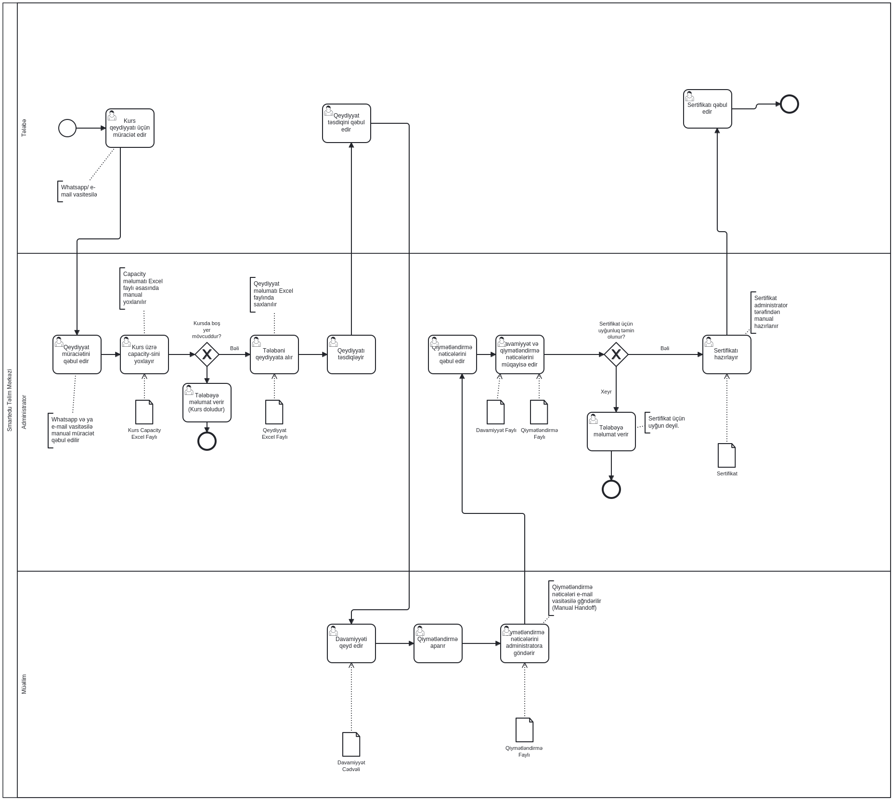
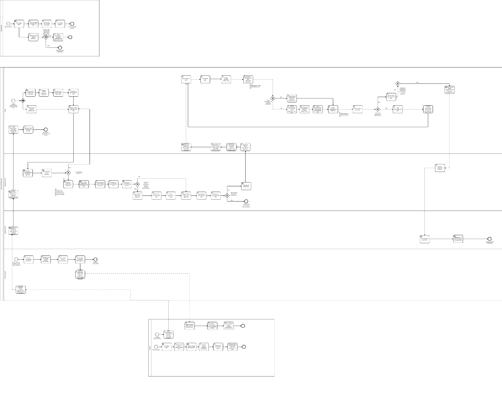
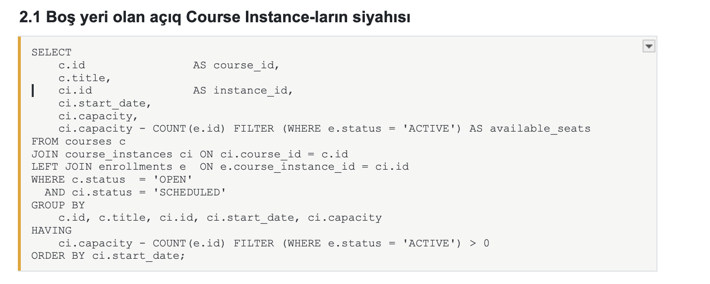
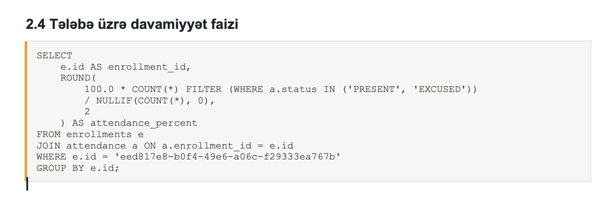
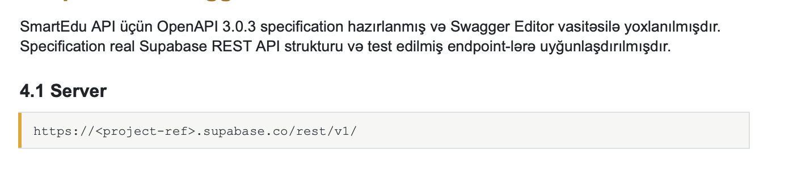
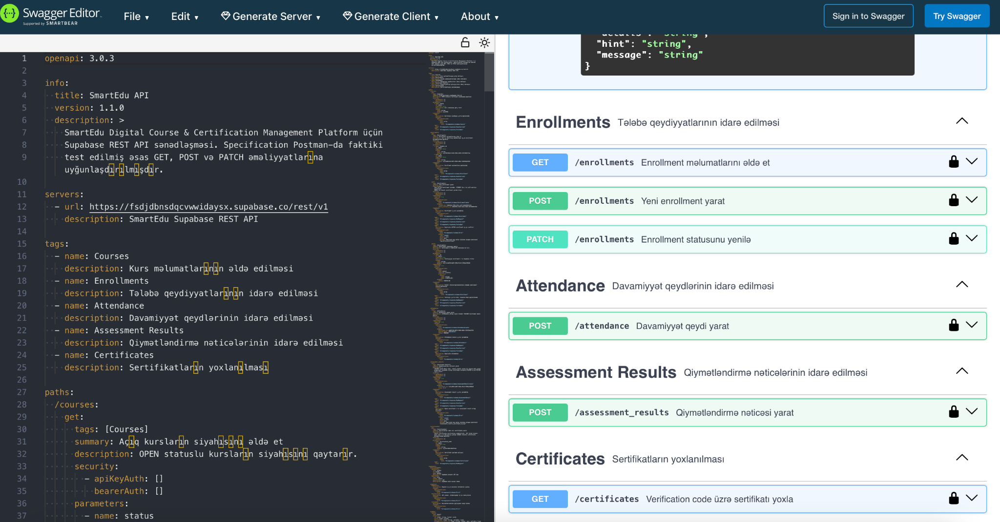
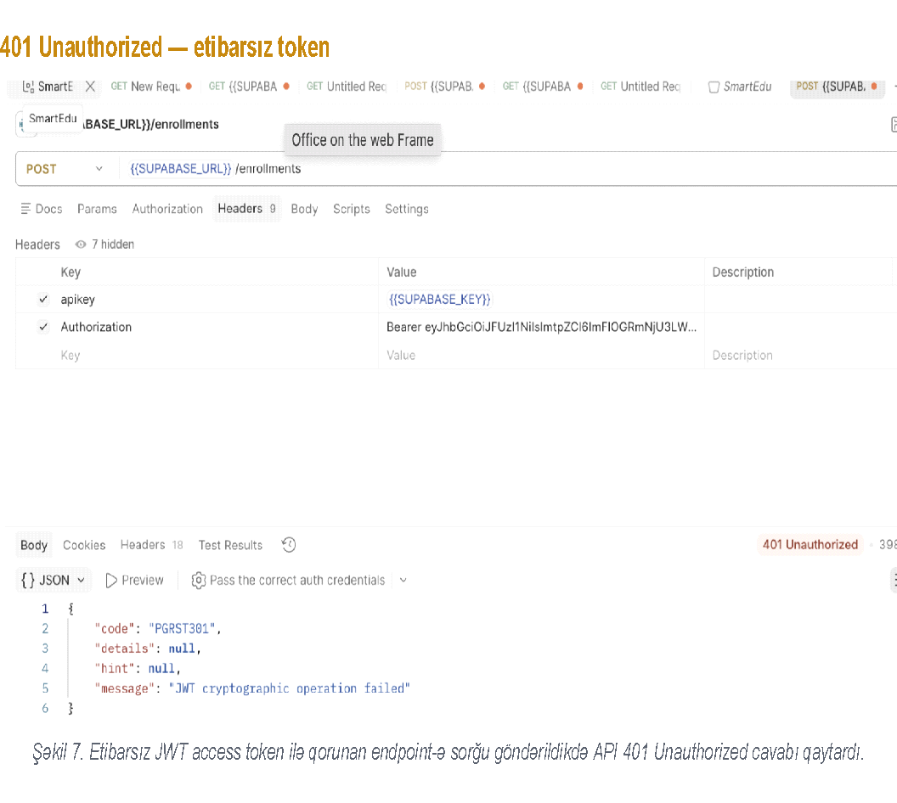
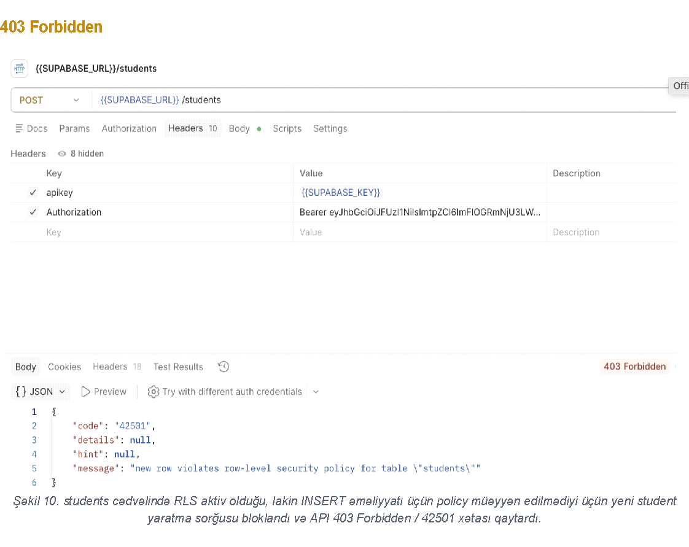

# SmartEdu Final Project Defense

## Slide 1

IT BUSINESS ANALYSIS COURSE

Final Project Defense

SmartEdu — Digital Course & Certification Management Platform

Group: 1   •   Case: SmartEdu

Defense date: 18  August 2026

Elmira Məmmədzadə

  ITBA Lead / Coordinator 

Aysel Abbasəliyeva

  Technical  Analyst

Vüsalə Həsənzadə

   Process Analyst

Alimə Kərimova

   Requirements & QA Analyst

Presented artifacts

Business Requirements Document — v1.1

Technical Document Package — ERD, SQL, API, OpenAPI, Security

BPMN 2.0 — AS-IS and TO-BE

RTM, Test Case Catalog, and UAT scenarios

## Slide 2

01 — Team & Case Scope

Team, selected case, and scope boundaries.

Team Members

Elmira Məmmədzadə

ITBA Lead / Coordinator

Aysel Abbasəliyeva

Technical  Analyst

Vüsalə Həsənzadə

Process Analyst

Alimə Kərimova

Requirements & QA Analyst

The RACI matrix is documented in the BRD “Document information” section.

Case Overview

SmartEdu

Digital Course & Certification Management Platform

Business context

The training center currently manages enrollment, attendance, assessment, and certification manually through Excel, WhatsApp, and email.

Main users

Student  ·  Teacher  ·  Administrator

Main process

Course → Course Instance → Enrollment → Attendance → Assessment Result → Certificate

Scope / Out of Scope

IN SCOPE

Course and user management

Online enrollment and seats

Attendance and assessment

Certificates and verification

Student tracking and reporting

Business rules and checks

OUT OF SCOPE

Payments, mobile app, external LMS/video

HR/payroll, physical infrastructure, AI recommendations

Printed certificates, full data migration

Production deployment and load testing

SmartEdu — ITBA Final Project Defense

2

## Slide 3

02 — Problem Statement & Business Need

The real business problem and need behind AS-IS.

Business Problem

Enrollment, attendance, assessment, and certification are fragmented across Excel, WhatsApp, and email. Capacity, prerequisites, and eligibility are checked manually.

Outcome: delays, human error, duplicates, and invisible statuses

Business Need

Unify these four processes in one traceable, automated platform, enforce rules, and provide Student self-service.

BN-01

Automated enrollment and self-service portal

BN-02

System-level capacity/prerequisite/duplicate rules

BN-04

Automatic certificate eligibility

BN-06

JWT/RLS role, ownership, and audit controls

Success Criteria

Significantly reduce manual enrollment

Automatically check capacity/prerequisites

Automatically calculate eligibility

Significantly reduce report preparation time

Minimize duplicates; single database

Student real-time self-service status/results

Key Assumptions

Course/student/teacher data obtainable from current sources; full historical migration excluded

Several simultaneous courses allowed; second ACTIVE enrollment in the same instance prohibited

Attendance entered by assigned teachers only

Web-based, single training center; multi-tenant/native mobile excluded

SmartEdu — ITBA Final Project Defense

3

## Slide 4

03 — AS-IS Process & Pain Points

Current process and main inefficiencies.

AS-IS BPMN 2.0

Pain Points

PP-01

No single source of information

PP-02

No real-time capacity check

PP-03

Manual prerequisite checks

PP-04

Manual handoff — e-mail / WhatsApp

PP-05

Certificate eligibility is calculated manually

PP-06

No self-service portal

Root Cause Notes

Process — manual enrollment, validation, eligibility, and handoffs.

Technology — no central platform, automatic rules, or audit log.

Data — separate Excel files; no single source.

SmartEdu — ITBA Final Project Defense

4



## Slide 5

04 — Stakeholders & Elicitation Approach

Stakeholders and methods used to clarify requirements.

Stakeholder Register Summary

Stakeholder

Influence

Interest

Role

Administrator

High

High

Main key user

Teacher

Medium

High

Academic recording

Student

Medium

High

Self-service user

Product Owner

High

High

Sign-off / decision

Project Manager

High

High

Coordination

Sign-off: Business Owner · Administrator · Teacher · Student · IT Business Analyst

Elicitation Plan

Business Interview

Direct Administrator/Teacher/Student interviews to learn actual AS-IS flow

Document Analysis

Registration/Capacity Excel files, attendance sheets, assessment records

Observation

Observe actual execution to discover undocumented steps

Process Modeling

BPMN AS-IS/TO-BE modeling to validate pain points visually

Sample Questions

How is enrollment handled and who participates?

How are capacity/prerequisites checked?

What information determines certificate eligibility?

Which files store enrollment/attendance/certificates?

How are assessments sent to administrators?

How do Students track status/results?

Risks / Dependencies

Business Owner must approve capacity, prerequisites, pass score, minimum attendance

Depends on correct Teacher assignments

Relevant stakeholder provides e-certificate template

Separate legacy Excel loading/migration plan required

Numeric NFRs need Technical Design approval

SmartEdu — ITBA Final Project Defense

5

## Slide 6

05 — TO-BE Solution Direction

Improved business process and how it meets the need.

TO-BE BPMN 2.0

Full diagram appears on a landscape page in BRD Section 7.2.

Solution Highlights

Self-service enrollment — Students view OPEN Courses and enroll

Automatic registration-window/capacity/duplicate/prerequisite checks

Digital attendance/assessment; automatic PASSED/FAILED

Automatic eligibility, e-certificates, public verification

Status Lifecycle

Course

DRAFT → OPEN → CLOSED → COMPLETED  ·  CANCELLED / ARCHIVED

Course Instance

SCHEDULED → ONGOING → COMPLETED  ·  CANCELLED

Enrollment

ACTIVE → COMPLETED  |  ACTIVE → CANCELLED

Certificate

ELIGIBLE → ISSUED → REVOKED

SmartEdu — ITBA Final Project Defense

6

SMARTEDU



## Slide 7

06 — Requirements, User Stories & Acceptance Criteria

Clarified functional requirements and story behavior.

Top Requirements

FR-STU-04

Show Students only OPEN Courses with vacant seats.

FR-ADM-08

Administrators must be able to create/edit course instance sessions (date, time, teacher).

FR-TCH-02

Teachers access assigned instances/sessions only.

FR-STU-02

Students see own enrollment/attendance/results/certificates; others' resources return 403 Forbidden.

User Stories

US-01

As an Administrator, I want Courses with pass_score, minimum attendance, and prerequisites so the system enforces assessment/certification rules.

US-04

As a Student, I want to see available OPEN Courses to choose a suitable Course.

US-05

As a Student, I want to enroll myself in an eligible Course through the system.

US-06

As a Student, I want to see why an enrollment attempt failed so I understand why it was not created.

Acceptance Criteria

AC-04

Given 

The catalog contains OPEN, DRAFT, CLOSED, and ARCHIVED Courses

When 

Student views catalog

Then 

OPEN Courses only

AC-09

Given 

The Student already has an ACTIVE enrollment for this instance

When 

The Student attempts another enrollment

Then 

The operation is rejected with 409 Conflict

AC-06

Given 

Prerequisite exists; Student has not PASSED

When 

The Student attempts enrollment

Then 

Enrollment is rejected

SmartEdu — ITBA Final Project Defense

7

## Slide 8

07 — Business Rules, Validations & Edge Cases

Make logic visible before API/database design.

Business Rules

BR-006

Enrollment for OPEN Courses only.

BR-007

ACTIVE enrollments cannot exceed instance capacity.

BR-008

One ACTIVE enrollment per Student + Instance.

BR-009

Required prerequisite must be PASSED.

BR-016 / 017

Automatic PASSED/FAILED from pass_score.

BR-023

Unique verification code per Certificate.

BR-026

Teacher entries for assigned sessions only.

Validation Logic

Course

UUID format, VARCHAR length, status enum

Session

Required start_date/end_date, capacity > 0, ACTIVE Teacher

User

Unique email, role/status enum, password hash

Enrollment

Existing Student/Instance, OPEN, capacity, duplicates, prerequisite

Attendance

One record per session_date; PRESENT / ABSENT / EXCUSED

Assessment

Score range, one result per enrollment, pass_score comparison

Certificate

ELIGIBLE conditions, unique verification_code, status enum

Edge Cases / Exceptions

EC-01

Two Students request final seat → transaction-level capacity control.

EC-02

Second ACTIVE attempt → 409 Conflict.

EC-03

Course status changes after catalog viewing → recheck during processing.

EC-06

Teacher enters another session's attendance → 403 Forbidden.

EC-07

Second attendance for session_date → duplicate not saved.

EC-08

No attendance → NULLIF prevents division by zero.

SmartEdu — ITBA Final Project Defense

8

## Slide 9

08 — Technical Design: Data + API

Link business requirements with actual technical artifacts.

ERD / Data Model

USER

role · status

STUDENT

      1:0..1

TEACHER

1:0..1

COURSE

pass_score · min_att%

COURSE_INSTANCE

capacity · teacher_id

prerequisite 1 : 0..N

ENROLLMENT

status · date

ATTENDANCE

session_date · status

ASSESSMENT_RESULT

score · result_status

CERTIFICATE

verification_code

1 : N

1 : 1

1 : 0..1

AUDIT_LOG

critical changes

PK/FK: UUID PKs for all entities; FKs/cardinality documented.

Enums for Course, Instance, Enrollment, Assessment Result, Certificate.

Audit fields: created_at/updated_at, append-only AUDIT_LOG.

API Design

GET

/courses?status=eq.OPEN

OPEN Course catalog

POST

/enrollments

New ACTIVE enrollment

PATCH

/enrollments?id=eq.{id}

Transition to CANCELLED

POST

/attendance

Attendance recording

POST

/assessment_results

Assessment result

GET

/certificates?verification_code=eq.{code}

Public verification

POST /enrollments — request

```json
{
  "student_id": "48f443e4-…",
  "course_instance_id": "d492994c-…"
}
```


409 Conflict — BR-008 violation

```json
{
  "code": "23505",
  "message": "duplicate key value violates
   unique constraint \"uq_active_enrollment\""
}
```


Supabase REST API · OpenAPI 3.0.3 validated in Swagger Editor.

SmartEdu — ITBA Final Project Defense

9

ADMIN

     1:0..1

## Slide 10

09 — SQL Queries

Selected SQL queries

SmartEdu — ITBA Final Project Defense

9




## Slide 11




## Slide 12

10 — OpenAPI / Swagger Example

SmartEdu — ITBA Final Project Defense

9

Method

Endpoint

Role

Description

GET

/courses?status=eq.OPEN

STUDENT / TEACHER / ADMIN

Retrieves OPEN Courses

POST

/enrollments

STUDENT / ADMIN

Creates ACTIVE enrollment

GET

/enrollments?student_id=eq.{studentId}

STUDENT / TEACHER (restricted) / ADMIN

Retrieves enrollments

PATCH

/enrollments?id=eq.{enrollmentId}

STUDENT (self) / ADMIN

Changes enrollment to CANCELLED

POST

/attendance

TEACHER

Creates attendance records

POST

/assessment_results

TEACHER

Creates assessment results; determines PASSED/FAILED

GET

/certificates?verification_code=eq.{code}

PUBLIC

Verifies ISSUED Certificates by code

4.2 Documented endpoints





## Slide 13

11 — Error Catalog

Real Error examples

SmartEdu — ITBA Final Project Defense

9





## Slide 14

12 — Security, Error Handling & Testing

Solution behavior in real and negative scenarios.

Security Model

Roles

STUDENT  ·  TEACHER  ·  ADMIN  ·  PUBLIC (anon)

Auth

Supabase Authentication — JWT (access_token/refresh_token), apikey header.

Access rules

STUDENT

own data only

TEACHER

assigned sessions/students only

ADMIN

administrative access

PUBLIC

ISSUED verification only

Database RLS — auth.uid() ownership check.

Error Catalog

400

Bad Request

Validation / database error

401

Unauthorized

Missing, invalid, expired token

403

Forbidden

RLS prohibits operation

404

Not Found

Resource nonexistent

409

Conflict

Unique constraint / duplicate ACTIVE enrollment

Real examples

23505  duplicate ACTIVE enrollment

42501  row-level security policy

PGRST303  JWT expired

Testing Pack

35

Test Cases in catalog

15

UAT scenarios

63

RTM rows — 63 fully traceable

Test types

Positive · Negative · Validation · Authorization · Conflict

Entry / exit criteria

At least 90% TC-01…TC-35 success; no open Critical/High defects

No data leakage in 401/403/409 and RLS scenarios

Business Owner/team final sign-off

SmartEdu — ITBA Final Project Defense

10

## Slide 15

13 — Traceability & Impact Analysis

Evidence that important requirements link to design/tests.

Traceability Matrix Snapshot

Business Need  →  Requirement  →  User Story  →  BPMN / API / DB  →  Test Case

BN ID

BR ID

FR ID 

TC ID

Status

BN-02

BR-001

FR-ADM-07 

TC-13

Covered

BN-01

BR-003, BR-029

FR-ADM-04 

BN-01

BR-005

FR-ADM-05 

BN-01

BR-004, 009

FR-ADM-09 

Impact Example

If BR-001 (capacity rule) changes:

Requirement impacted

FR-ADM-07

API impacted

POST /enrollments

PATCH /course_instances

DB impacted

COURSE_INSTANCE.capacity

Test impacted

TC-13

Code module

MOD-COURSE-MGMT

Trace a rule change from requirement to test in one row.

SmartEdu — ITBA Final Project Defense

11

Partially covered

Partially covered

TC to be prepared

FR ID Description 

Administrators must not reduce course instance capacity below the current active enrollment count.

Administrators must be able to create and revoke teacher assignments to specific course instances/sessions.

Administrators must be able to create, edit, delete, or CANCEL courses.

Administrators must be able to define course prerequisites.

TC-13, TC-41 

TC-12 

Planned

## Slide 16

14 — Final Outcome & Business Value

AS-IS to TO-BE changes and solution value.

Before

AS-IS

Fragmented data

Excel, WhatsApp, email — no single source

Manual validation

Manual capacity/prerequisites

Manual certification

Eligibility through file comparisons

No status visibility

Students contact administrators for each update

After

TO-BE

Single database

All processes in a centralized relational database

Automatic validation

Registration window, capacity, duplicates, prerequisites

Automatic certification

Eligibility calculated; coded e-certificates issued

Self-service tracking

Students track enrollment/attendance/results/certificates

Business Value

Fewer manual operations and duplicates

Faster enrollment/certification

System-enforced business rules

Lower human error risk

Single database and process transparency

Student self-service and real-time status

Improved auditing and faster reports

SmartEdu turns fragmented manual course management into a centralized, automated, traceable digital platform.

SmartEdu — ITBA Final Project Defense

12

## Slide 17

Q & A

SmartEdu — Digital Course & Certification Management Platform

Elmira Məmmədzadə  ·  Aysel Abbasəliyeva  ·  Vüsalə Həsənzadə  ·  Alimə Kərimova

SmartEdu — ITBA Final Project Defense

13
