SmartEdu

Digital Course & Certification Management Platform

TECHNICAL DOCUMENT PACKAGE

ERD / Data Model • SQL Queries • API Design • OpenAPI / Swagger • Security & Error Catalog

| Project | SmartEdu — Digital Course & Certification Management Platform |
| --- | --- |
| Document type | Technical Document Package |
| Group | 1 — IT Business Analysis Course, Final Project |
| Date | 18 August 2026 |
| Related document | SmartEdu — BRD / SRS |
| Status | Final version |

| About this document: This Technical Document Package continues the BRD/SRS and covers technical solutions based on its business requirements, business rules (BR), and acceptance criteria (AC). |
| --- |

TABLE OF CONTENTS

1. ERD / Data Model3

1.1 Entity list and descriptions3

1.2 Table structure (PK / FK / Cardinality / Status)3

1.3 Cardinality summary6

2. SQL Queries7

2.1 Open Course Instances with available seats7

2.2 Prerequisite check7

2.3 Duplicate active student enrollment check8

2.4 Student attendance percentage9

2.5 Certificate eligibility calculation9

2.6 Administrator report: students awaiting certificates10

3. API Design and JSON Examples11

3.1 Endpoint summary11

3.2 GET /courses11

3.3 POST /enrollments12

3.4 GET /enrollments?student_id=eq.{studentId}12

3.5 POST /attendance13

3.6 POST /assessment_results13

3.7 GET /certificates?verification_code=eq.{code} (PUBLIC)

3.8 PATCH//enrollments?id=eq.{id}

13

4. OpenAPI / Swagger Example14

4.1 Server14

4.2 Documented endpoints14

4.3 Security Schemes14

4.4 Covered components14

4.5 Validation result14

5. Security and Error Catalog16

5.1 Authentication16

5.2 Authorization — Role matrix16

5.3 Error Catalog17

5.4 Real Error examples18

5.5 Additional security measures20

## 1. ERD / Data Model

The following data model covers SmartEdu's main entities, PK/FK relationships, cardinality, status fields, and audit fields.

### 1.1 Entity list and descriptions

| Entity | Description |
| --- | --- |
| USER | Common identification for all system users (student, teacher, admin). |
| STUDENT | Student profile; linked 1:1 to USER. |
| TEACHER | Teacher profile; linked 1:1 to USER. |
| COURSE | Course catalog, including prerequisites, pass score, and minimum attendance percentage. |
| COURSE_INSTANCE | A specific course session (dates, teacher, capacity, status). |
| ENROLLMENT | Student enrollment in a course instance and its status. |
| ATTENDANCE | Student attendance record for each session. |
| ASSESSMENT_RESULT | Assessment result for an enrollment. |
| CERTIFICATE | Certificate generated when enrollment eligibility is met. |
| AUDIT_LOG | Audit trail for all critical changes. |

Table 1. SmartEdu data model entities

### 1.2 Table structure (PK / FK / Cardinality / Status)

USER

| Field | Type | Explanation |
| --- | --- | --- |
| id (PK) | UUID | Unique user identifier. |
| full_name | VARCHAR(150) | First name, surname. |
| email | VARCHAR(150), UNIQUE | Used for login. |
| password_hash | VARCHAR(255) | Bcrypt hash. |
| role | ENUM(STUDENT, TEACHER, ADMIN) | For role-based authorization. |
| status | ENUM(ACTIVE, DISABLED) | Account status. |
| created_at / updated_at | TIMESTAMP | Audit field. |

COURSE

| Field | Type | Explanation |
| --- | --- | --- |
| id (PK) | UUID | Course identifier. |
| title | VARCHAR(200) | Course name. |
| description | TEXT | Course description. |
| prerequisite_course_id (FK → COURSE.id) | UUID, NULLABLE | Self-referencing prerequisite (0..1). |
| pass_score | DECIMAL(5,2) | Passing score (BR-016, BR-017). |
| min_attendance_percent | DECIMAL(5,2) | Minimum attendance percentage (BR-020). |
| status | ENUM(DRAFT, OPEN, CLOSED, ARCHIVED) | Enrollment is allowed only for OPEN Courses (BR-006). |
| created_at / updated_at | TIMESTAMP | Audit field. |

COURSE_INSTANCE

| Field | Type | Explanation |
| --- | --- | --- |
| id (PK) | UUID | Course Instance identifier. |
| course_id (FK → COURSE.id) | UUID | 1 COURSE : N COURSE_INSTANCE. |
| teacher_id (FK → TEACHER.id) | UUID | 1 TEACHER : N COURSE_INSTANCE. |
| start_date / end_date | DATE | Session dates. |
| capacity | INTEGER | Maximum ACTIVE enrollments (BR-007). |
| status | ENUM(SCHEDULED, ONGOING, COMPLETED, CANCELLED) | Session status. |
| created_at / updated_at | TIMESTAMP | Audit field. |

ENROLLMENT

| Field | Type | Explanation |
| --- | --- | --- |
| id (PK) | UUID | Enrollment identifier. |
| student_id (FK → STUDENT.id) | UUID | 1 STUDENT : N ENROLLMENT. |
| course_instance_id (FK → COURSE_INSTANCE.id) | UUID | 1 COURSE_INSTANCE : N ENROLLMENT. |
| enrollment_date | TIMESTAMP | Enrollment date. |
| status | ENUM(ACTIVE, CANCELLED, COMPLETED) | BR-008: Only 1 ACTIVE enrollment per Student + Course Instance. |
| cancelled_at | TIMESTAMP, NULLABLE | Cancellation date (BR-010). |

ATTENDANCE

| Field | Type | Explanation |
| --- | --- | --- |
| id (PK) | UUID | Record identifier. |
| enrollment_id (FK → ENROLLMENT.id) | UUID | 1 ENROLLMENT : N ATTENDANCE (1 record per session_date). |
| session_date | DATE | The day the record covers. |
| status | ENUM(PRESENT, ABSENT, EXCUSED) | Attendance status. |
| recorded_by (FK → TEACHER.id) | UUID | BR-026: Assigned Teacher only. |
| recorded_at | TIMESTAMP | Audit field. |

ASSESSMENT_RESULT

| Field | Type | Explanation |
| --- | --- | --- |
| id (PK) | UUID | Result identifier. |
| enrollment_id (FK → ENROLLMENT.id) | UUID, UNIQUE | 1 ENROLLMENT : 1 ASSESSMENT_RESULT. |
| score | DECIMAL(5,2) | Score achieved. |
| result_status | ENUM(PASSED, FAILED) | Automatic PASSED/FAILED from score versus course.pass_score (BR-016, BR-017). |
| recorded_by (FK → TEACHER.id) | UUID | BR-026 requirement. |
| recorded_at | TIMESTAMP | Audit field. |

CERTIFICATE

| Field | Type | Explanation |
| --- | --- | --- |
| id (PK) | UUID | Certificate identifier. |
| enrollment_id (FK → ENROLLMENT.id) | UUID, UNIQUE | 1 ENROLLMENT : 0..1 CERTIFICATE. |
| verification_code | VARCHAR(20), UNIQUE | BR-023: unique verification code. |
| issue_date | TIMESTAMP | Creation date. |
| status | ENUM(ELIGIBLE, ISSUED, REVOKED) | Certificate eligibility and issuance rules follow BR-020, BR-021, BR-022. |
| pdf_url | VARCHAR(500) | Certificate document link. |

AUDIT_LOG

| Field | Type | Explanation |
| --- | --- | --- |
| id (PK) | UUID | Log identifier. |
| entity_name / entity_id | VARCHAR / UUID | Entity changed. |
| action | ENUM(CREATE, UPDATE, DELETE) | Operation type. |
| performed_by (FK → USER.id) | UUID | User who made the change. |
| old_value / new_value | JSONB | Values before and after the change. |
| performed_at | TIMESTAMP | Operation time. |

### 1.3 Cardinality summary

| Contact | Cardinality |
| --- | --- |
| USER — STUDENT | 1 : 0..1 (A USER may have at most 1 STUDENT profile; being a STUDENT is optional.) |
| USER — TEACHER | 1 : 0..1 (A user may or may not be a teacher, with at most 1 Teacher profile.) |
| COURSE — COURSE (prerequisite) | 1 : 0..N (self-referencing) |
| COURSE — COURSE_INSTANCE | 1 : N (A course may have many instances.) |
| TEACHER — COURSE_INSTANCE | 1 : N |
| COURSE_INSTANCE — ENROLLMENT | 1 : N (N ≤ capacity, BR-007) |
| STUDENT — ENROLLMENT | 1 : N |
| ENROLLMENT — ATTENDANCE | 1 : N |
| ENROLLMENT — ASSESSMENT_RESULT | 1 : 1 |
| ENROLLMENT — CERTIFICATE | 1 : 0..1 |

Table 2. Cardinality relationships between entities

## 2. SQL Queries

These PostgreSQL queries support validation of the main business rules.

### 2.1 Open Course Instances with available seats

| SELECT     c.id                AS course_id,     c.title,     ci.id               AS instance_id,     ci.start_date,     ci.capacity,     ci.capacity - COUNT(e.id) FILTER (WHERE e.status = 'ACTIVE') AS available_seats FROM courses c JOIN course_instances ci ON ci.course_id = c.id LEFT JOIN enrollments e  ON e.course_instance_id = ci.id WHERE c.status  = 'OPEN'   AND ci.status = 'SCHEDULED' GROUP BY     c.id, c.title, ci.id, ci.start_date, ci.capacity HAVING     ci.capacity - COUNT(e.id) FILTER (WHERE e.status = 'ACTIVE') > 0 ORDER BY ci.start_date; |
| --- |

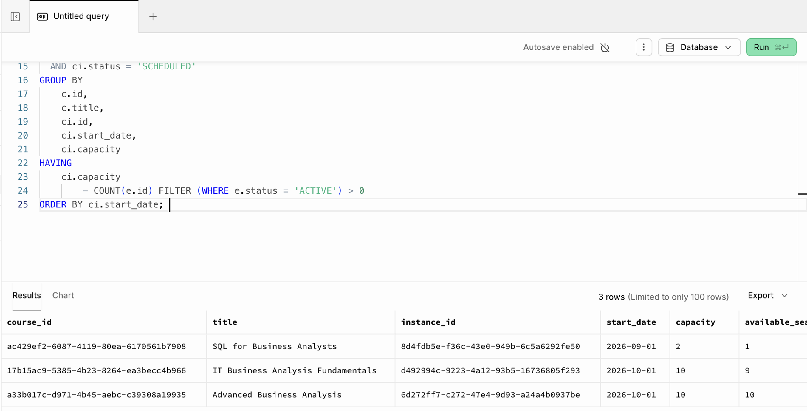

Figure 1. Executed query and returned rows

### 2.2 Prerequisite check

Check whether the course admission prerequisite is met.

| SELECT EXISTS (     SELECT 1     FROM enrollments e     JOIN assessment_results ar ON ar.enrollment_id = e.id     JOIN course_instances ci   ON ci.id = e.course_instance_id     WHERE e.student_id = '48f443e4-9c66-458e-a92b-ef4f3301ffae'       AND ci.course_id = (           SELECT prerequisite_course_id           FROM courses           WHERE id = 'a33b017c-d971-4b45-aebc-c39308a19935'       )       AND ar.result_status = 'PASSED' ) AS prerequisite_met; |
| --- |

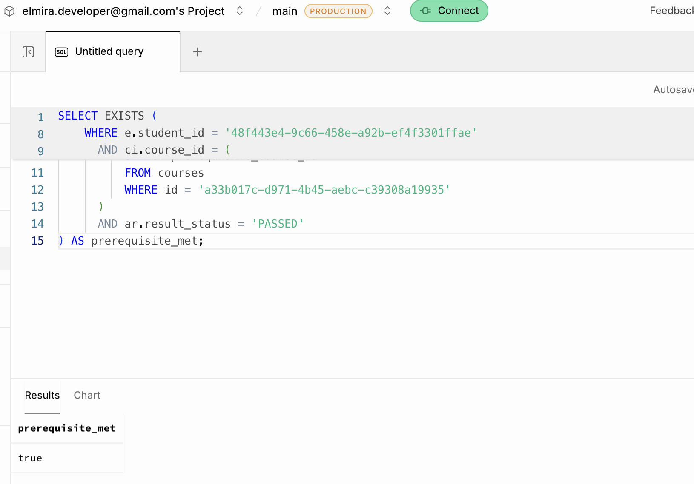

Figure 2. Prerequisite validation

### 2.3 Duplicate active student enrollment check

| SELECT COUNT(*) > 0 AS already_enrolled FROM enrollments WHERE student_id         = '48f443e4-9c66-458e-a92b-ef4f3301ffae'   AND course_instance_id = 'd492994c-9223-4a12-93b5-16736805f293'   AND status             = 'ACTIVE'; |
| --- |

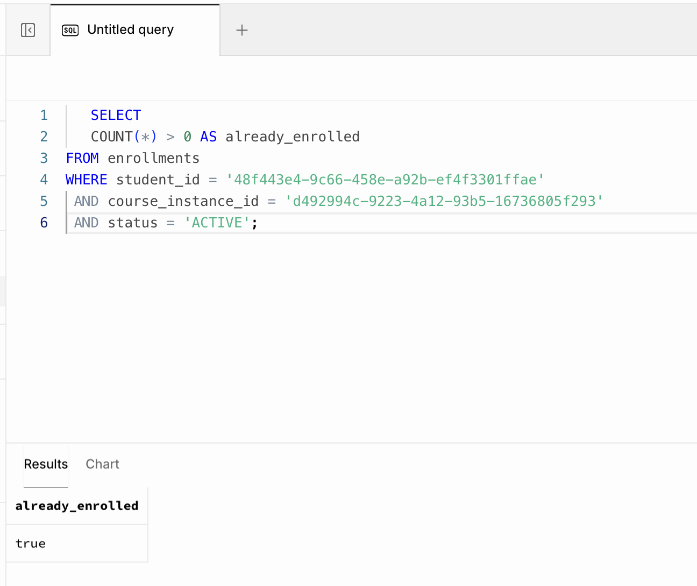

Figure 3. Active enrollment existence check

### 2.4 Student attendance percentage

| SELECT     e.id AS enrollment_id,     ROUND(         100.0 * COUNT(*) FILTER (WHERE a.status IN ('PRESENT', 'EXCUSED'))         / NULLIF(COUNT(*), 0),         2     ) AS attendance_percent FROM enrollments e JOIN attendance a ON a.enrollment_id = e.id WHERE e.id = 'eed817e8-b0f4-49e6-a06c-f29333ea767b' GROUP BY e.id; |
| --- |

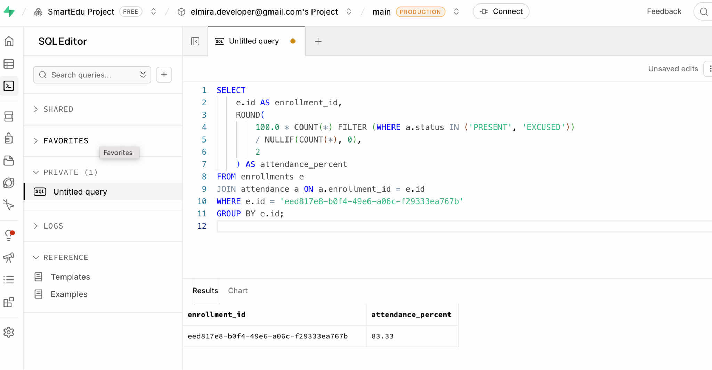

Figure 4. Calculated attendance percentage

### 2.5 Certificate eligibility calculation

Calculate whether the student qualifies for a certificate.

| SELECT     e.id AS enrollment_id,     ar.result_status = 'PASSED'                            AS passed,     att.attendance_percent,     c.min_attendance_percent,     att.attendance_percent >= c.min_attendance_percent     AS attendance_ok,     (         e.status = 'COMPLETED'         AND ar.result_status = 'PASSED'         AND att.attendance_percent >= c.min_attendance_percent     ) AS certificate_eligible FROM enrollments e JOIN course_instances ci   ON ci.id = e.course_instance_id JOIN courses c             ON c.id  = ci.course_id JOIN assessment_results ar ON ar.enrollment_id = e.id JOIN LATERAL (     SELECT         ROUND(             100.0 * COUNT(*) FILTER (WHERE status IN ('PRESENT', 'EXCUSED'))             / NULLIF(COUNT(*), 0),             2         ) AS attendance_percent     FROM attendance     WHERE enrollment_id = e.id ) att ON TRUE WHERE e.id = 'eed817e8-b0f4-49e6-a06c-f29333ea767b'; |
| --- |

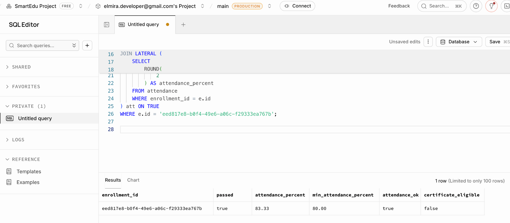

Figure 5. Certificate eligibility calculation

### 2.6 Administrator report: students awaiting certificates

| SELECT     s.id AS student_id,     u.full_name,     c.title AS course_title,     e.id    AS enrollment_id FROM enrollments e JOIN students s          ON s.id  = e.student_id JOIN users u             ON u.id  = s.user_id JOIN course_instances ci ON ci.id = e.course_instance_id JOIN courses c           ON c.id  = ci.course_id LEFT JOIN certificates cert ON cert.enrollment_id = e.id WHERE e.status = 'COMPLETED'   AND cert.id IS NULL ORDER BY u.full_name; |
| --- |

| Note: The query returned no rows in the current test data because no COMPLETED enrollment without a certificate exists. It identifies completed enrollments whose certificates have not yet been created. |
| --- |

## 3. API Design and JSON Examples

SmartEdu uses Supabase REST API. All endpoints use {{SUPABASE_URL}} as the base URL. Protected endpoints use Bearer JWT and the apikey header. Content-Type: application/json.

### 3.1 Endpoint summary

| Method | Path | Role | Purpose |
| --- | --- | --- | --- |
| GET | /courses?status=eq.OPEN | STUDENT, TEACHER, ADMIN | Get OPEN Courses (AC-007) |
| GET | /courses?id=eq.{courseId} | STUDENT, TEACHER, ADMIN | Get Course details and prerequisites |
| POST | /enrollments | STUDENT (self), ADMIN | Create ACTIVE enrollment (AC-011) |
| GET | /enrollments?student_id=eq.{studentId} | STUDENT (self), TEACHER (restricted), ADMIN | Get enrollment information |
| PATCH | /enrollments?id=eq.{enrollmentId} | STUDENT (self), ADMIN | Change enrollment to CANCELLED (BR-010) |
| POST | /attendance | TEACHER, ADMIN | Create attendance record (BR-012, BR-026) |
| POST | /assessment_results | TEACHER, ADMIN | Create Assessment Results and determine PASSED/FAILED (BR-016, BR-017, BR-026) |
| GET | /certificates?enrollment_id=eq.{enrollmentId} | STUDENT (self), ADMIN | Get the Student's Certificate information |
| GET | /certificates?verification_code=eq.{code} | PUBLIC | Verify an ISSUED Certificate by code (BR-023) |
| PATCH | /courses?id=eq.{courseId} | ADMIN | Soft-delete a Course by marking it ARCHIVED (BR-005) |
| GET | /vw_course_report | ADMIN | Get Course / result / Certificate reports |

Table 3. SmartEdu API endpoint summary

### 3.2 GET /courses

#### Query parameter

| status=eq.OPEN |
| --- |

#### Postman Request

| GET {{SUPABASE_URL}}/courses?status=eq.OPEN |
| --- |

#### Response — 200 OK

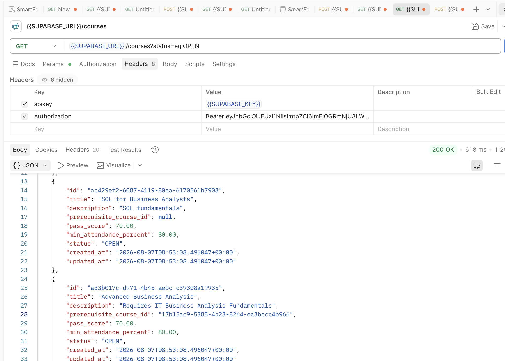

### 3.3 POST /enrollments

#### Request

| {   "student_id": "740635e3-785b-415c-ae37-dbde95b2fe5d",   "course_instance_id": "d492994c-9223-4a12-93b5-16736805f293" } |
| --- |

#### Response — 201 Created

| {   "id": "<generated_enrollment_id>",   "student_id": "740635e3-785b-415c-ae37-dbde95b2fe5d",   "course_instance_id": "d492994c-9223-4a12-93b5-16736805f293",   "enrollment_date": "<generated_timestamp>",   "status": "ACTIVE",   "cancelled_at": null } |
| --- |

#### Error — 409 Conflict (BR-008: Duplicate Active Enrollment)

| {   "code": "23505",   "details": null,   "hint": null,   "message": "duplicate key value violates unique constraint \"uq_active_enrollment\"" } |
| --- |

### 3.4 GET /enrollments?student_id=eq.{studentId}

#### Response — 200 OK

| 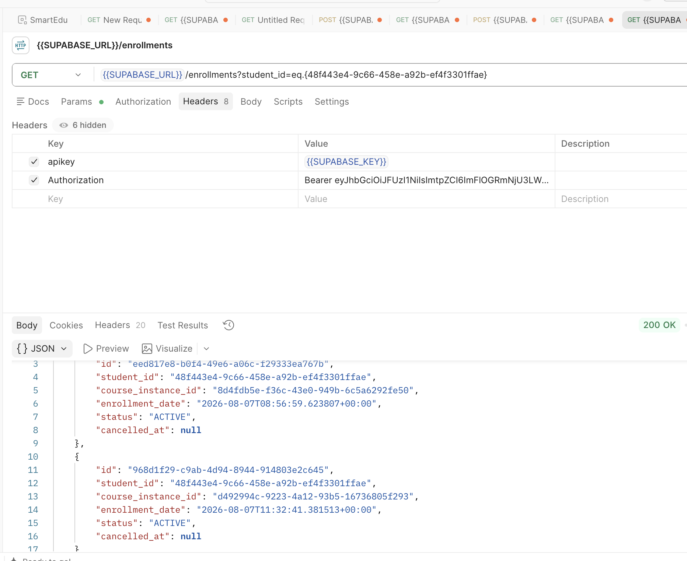 |
| --- |

### 3.5 POST /attendance

#### Request

| {     "enrollment_id": "eed817e8-b0f4-49e6-a06c-f29333ea767b",     "session_date": "2026-09-01",     "status": "PRESENT" } |
| --- |

#### Response — 201 Created

| {     "id": "68a1aa48-243e-45b4-98d4-e148300b4b15",     "enrollment_id": "eed817e8-b0f4-49e6-a06c-f29333ea767b",     "session_date": "2026-09-01",     "status": "PRESENT",     "recorded_by": "670a4a5d-d69a-4232-9bc4-349628305ba2",     "recorded_at": "2026-08-07T09:02:21.373634+00:00" } |
| --- |

### 3.6 POST /assessment_results

#### Request

| {   "enrollment_id": "1c2ca010-bdd7-449e-91c8-1338aa2366e0",   "score": 87.50 } |
| --- |

#### Response — 201 Created

POST succeeded. The response body was empty because Prefer: return=representation was not used. The created result was verified in the database:

| {   "id": "<generated_assessment_result_id>",   "enrollment_id": "1c2ca010-bdd7-449e-91c8-1338aa2366e0",   "score": 87.50,   "result_status": "PASSED",   "recorded_by": "<teacher_id>" } |
| --- |

| Note: Under BR-016/BR-017, result_status is calculated automatically by comparing score with Course pass_score. Since 87.50 ≥ 70, the result is PASSED. recorded_by identifies the Teacher assigned to the related Course Instance under BR-026. |
| --- |

### 3.7 GET /certificates?verification_code=eq.{code} (PUBLIC)

#### Request

| GET {{SUPABASE_URL}}/certificates?verification_code=eq.SE-2026-BC67F118 |
| --- |

#### Response — 200 OK

| [     {         "id": "cac8392a-8598-4669-95fc-f116ed576e1d",         "enrollment_id": "eed817e8-b0f4-49e6-a06c-f29333ea767b",         "verification_code": "SE-2026-BC67F118",         "issue_date": "2026-08-07T09:21:41.660275+00:00",         "status": "ISSUED",         "pdf_url": null     } ] |
| --- |

### 3.8 PATCH/enrollments?id=eq.{id}

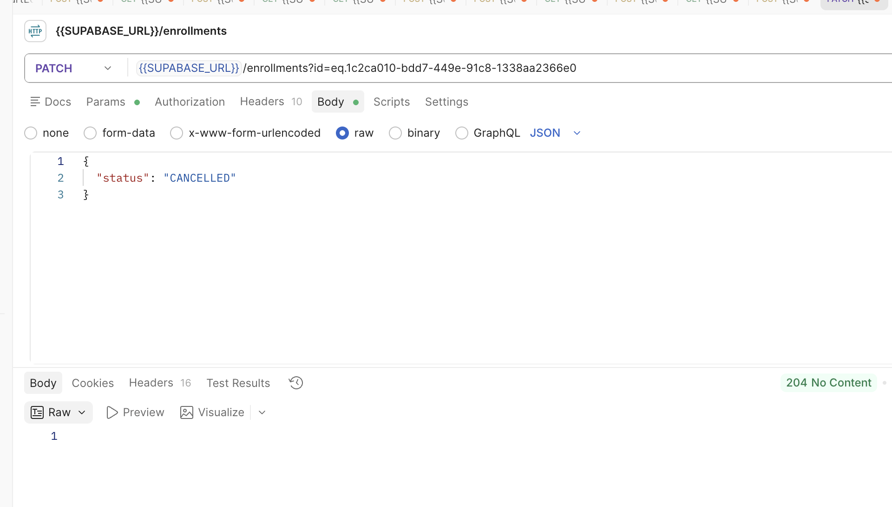

## 4. OpenAPI / Swagger Example

An OpenAPI 3.0.3 specification was prepared and checked in Swagger Editor, aligned with the actual Supabase REST structure and tested endpoints.

### 4.1 Server

| https://<project-ref>.supabase.co/rest/v1/ |
| --- |

Table 4. Endpoints documented in the OpenAPI specification

### 4.3 Security Schemes

### apikey — Supabase API key

### Bearer JWT — for authenticated STUDENT, TEACHER, and ADMIN users

### Public access — Certificate verification requires no JWT; apikey and anon RLS policy are used

### 4.4 Covered components

### Request body and response examples

### Query parameters

### Role-based authorization

### Supabase Row Level Security (RLS)

### 200 OK

### 201 Created

### 204 No Content

### 400 Bad Request

### 401 Unauthorized

### 403 Forbidden

### 409 Conflict

### Reusable schemas:

### Course

### EnrollmentCreate

### Enrollment

### AttendanceCreate

### Attendance

### AssessmentResultCreate

### AssessmentResult

### Certificate

### Error

### 4.5 Validation result

The OpenAPI specification was successfully validated in Swagger Editor.

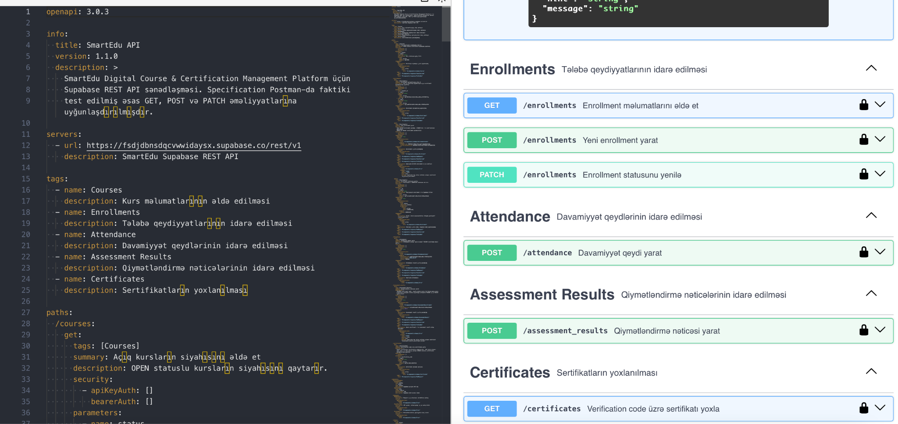

Figure 6. Swagger Editor: SmartEdu OpenAPI specification validation

| Note: The YAML file will be included separately in the appendix. |
| --- |

## 5. Security and Error Catalog

### 5.1 Authentication

Authentication uses Supabase Authentication and JWT (JSON Web Token).

Users authenticate with email/password. Supabase returns access_token and refresh_token after successful login.

Protected requests send the JWT access token through this header:

| Authorization: Bearer <access_token> |
| --- |

Supabase REST requests also use the project API key:

| apikey: <SUPABASE_KEY> |
| --- |

JWT identifies authentication status; RLS policies restrict access to authorized data and operations.

Public Certificate verification requires no user JWT and uses the anon role's RLS SELECT policy.

### 5.2 Authorization — Role matrix

SmartEdu defines three main roles: STUDENT, TEACHER, and ADMIN.

| Resource / Operation | STUDENT | TEACHER | ADMIN |
| --- | --- | --- | --- |
| GET /courses | ✓ (OPEN only) | ✓ | ✓ |
| POST /enrollments | ✓ (self only) | ✗ | ✓ |
| GET /enrollments | ✓ (own data only) | Restricted | ✓ |
| POST /attendance | ✗ | ✓ assigned students / sessions | ✓ |
| POST /assessment_results | ✗ | ✓ assigned students / sessions | ✓ |
| GET /certificates?verification_code=eq.{code} | ✓ (public) | ✓ (public) | ✓ (public) |
| PATCH /courses | ✗ | ✗ | ✓ |
| Administrative reports | ✗ | ✗ | ✓ |

Table 5. Role-based access matrix (RBAC)

| Note: BR-07/BR-08 are enforced in authorization middleware by comparing token role with resource owner (student_id / teacher_id) on each request. |
| --- |

Database authorization uses Supabase RLS. Policies link auth.uid() with system user information to check resource ownership and role.

STUDENT may perform permitted operations only on own data; TEACHER only on assigned academic data. ADMIN has broader management authority.

### 5.3 Error Catalog

The API uses actual error responses returned by Supabase/PostgreSQL.

| HTTP Status | Code / Error | Cause |
| --- | --- | --- |
| 400 Bad Request | Validation / Database Error | Invalid request or submitted data |
| 401 Unauthorized | JWT / Auth Error | Missing, invalid, or expired access token |
| 403 Forbidden | 42501 | RLS policy prohibits the operation |
| 404 Not Found | Resource not found | No resource matches the request |
| 409 Conflict | 23505 | UNIQUE violation, such as duplicate ACTIVE enrollment |

Table 6. HTTP status codes and causes

#### Duplicate Active Enrollment example

| {     "code": "23505",     "details": null,     "hint": null,     "message": "duplicate key value violates unique constraint \"uq_active_enrollment\"" } |
| --- |

This error occurs when the same student attempts multiple ACTIVE enrollments in the same instance.

#### RLS Authorization Error example

| {     "code": "42501",     "details": null,     "hint": null,     "message": "new row violates row-level security policy" } |
| --- |

This error indicates an operation prohibited by RLS policy.

### 5.4 Real Error examples

#### 401 Unauthorized — invalid token

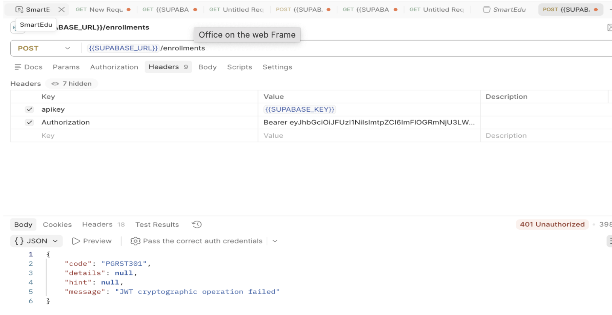

Figure 7. A protected request with an invalid JWT returned 401 Unauthorized.

#### 401 Unauthorized — expired token

Figure 8. An expired JWT returned 401 Unauthorized and PGRST303. “JWT expired” indicates token expiry.

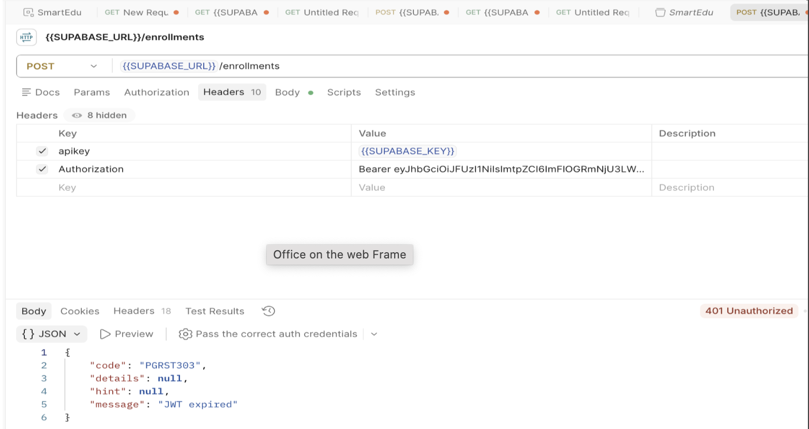

#### 400 Bad Request

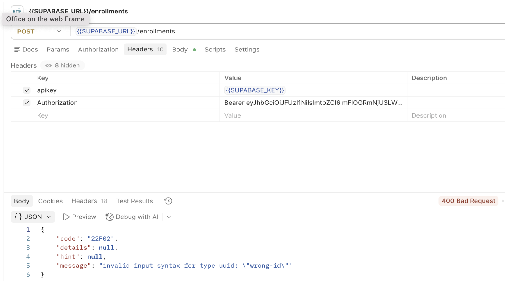

Figure 9. Invalid student_id UUID (wrong-id) returned 400 Bad Request and 22P02.

#### 403 Forbidden

Figure 10. RLS was enabled on students without an INSERT policy; student creation was blocked with 403 Forbidden / 42501.

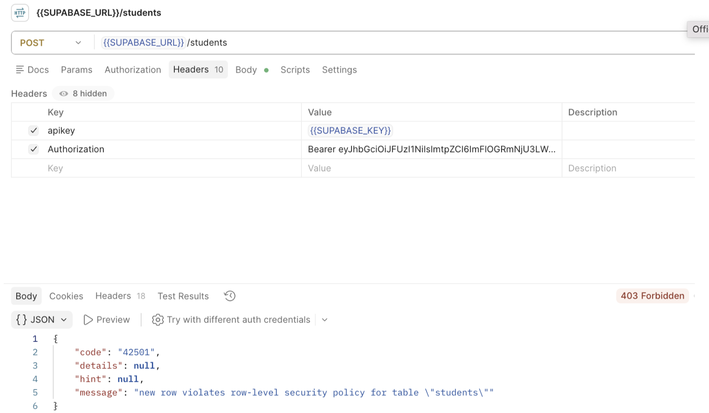

#### 404 Not Found

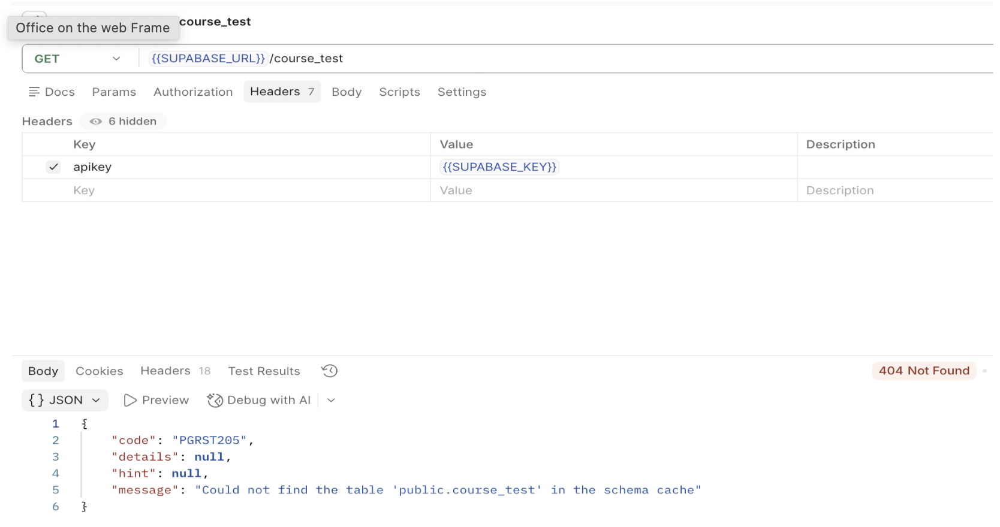

Figure 11. Accessing nonexistent course_test returned 404 Not Found / PGRST205.

### 5.5 Additional security measures

The following measures are planned:

JWT Authentication — protected resources accessible only to authenticated users.

Row Level Security (RLS) — row-level data access control.

Role-based authorization — permissions separated for STUDENT, TEACHER, and ADMIN.

Ownership control — permitted operations only on the user's own data.

API Key — apikey header in Supabase REST requests.

HTTPS — encrypted API communication.

Database constraints — PRIMARY KEY, FOREIGN KEY, UNIQUE, and CHECK protect data integrity.

Business rule validation — database triggers/functions check critical rules.

Public certificate verification — anon may read only ISSUED certificates.

#### Public Certificate Security

The Certificate verification endpoint is public:

| GET /certificates?verification_code=eq.{code} |
| --- |

No JWT is required. The anon RLS policy permits reading ISSUED certificates only.

## Source headers and footers

SmartEdu — Technical Document PackageIT Business Analysis Course · Final Project
